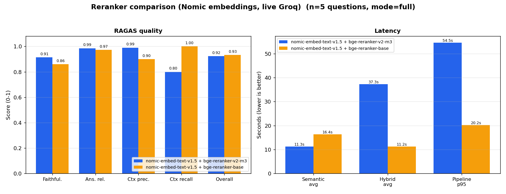
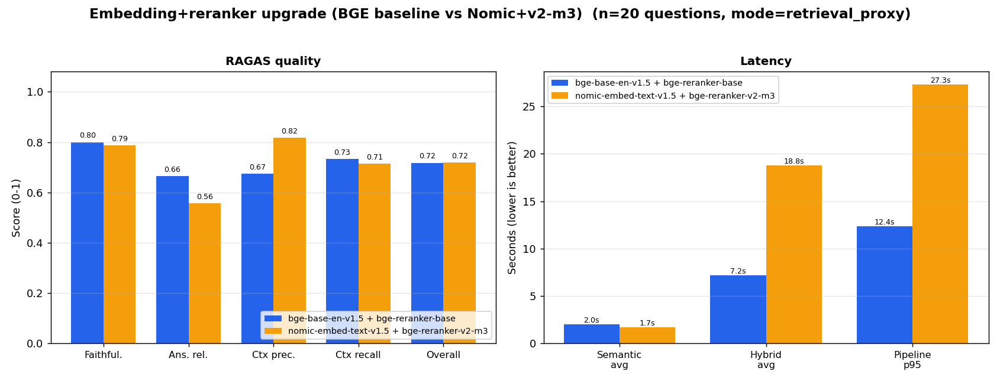
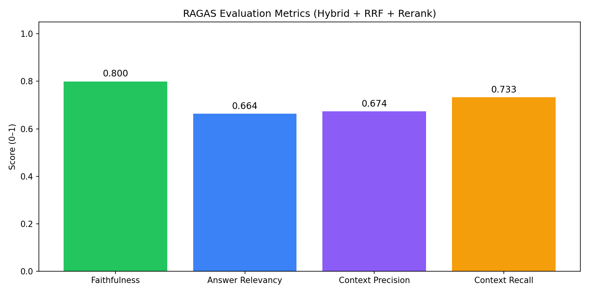
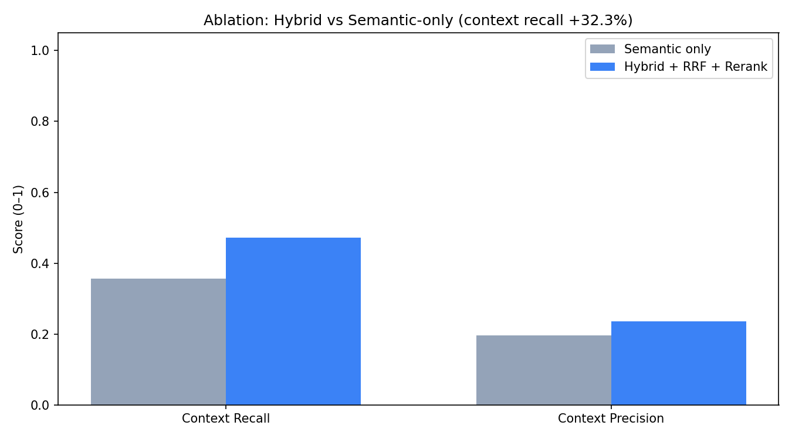
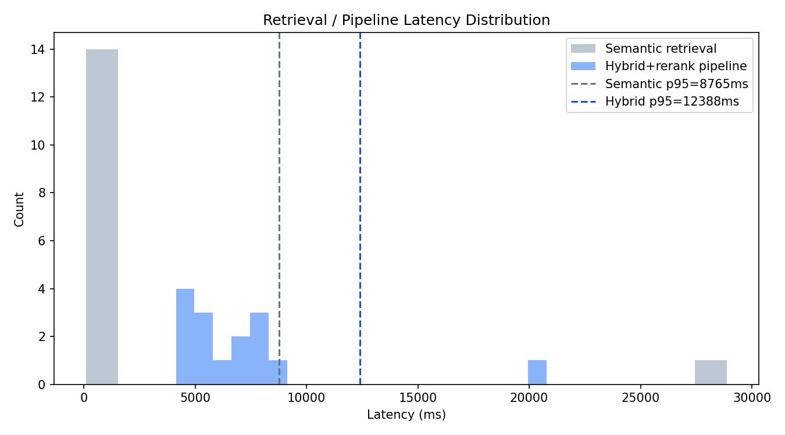

# PSA AI — Passive Safety Engineering Assistant (v5.0)

Production RAG stack for passive safety with **authority-tiered multilayer knowledge**
(six binding-force tiers from legal regulation through synthetic data), **eight use-case
modes**, metadata-aware retrieval (frontal≠side, legal≠rating), **chunk-level metadata
classifier**, conditional answer formatting, document upload API, and **CI regression
gates**. Scanned PDFs are ingested with **PaddleOCR** (or **PyMuPDF** for text-layer
PDFs) and **hierarchical chunking** (`ingestion/`).

> **v5.0 — Multilayer authority architecture** (Jun 2026):
> Corpus expanded from the UN R14/R16 pilot to **14 active PDFs** (9 legal, 3 Euro NCAP,
> 2 engineering references) plus **7 synthetic PROG_X** program documents.
> **11,941 chunks** carry `authority_tier`, `impact_mode`, and `license_status` metadata.
> Compliance queries hard-filter to `legal_binding` only; citations show **LEGAL / RATING /
> ENG-REF / OEM / HISTORICAL / SYNTHETIC** badges. Restore archived PDFs with
> `scripts/restore_from_archive.py`; evaluate with `scripts/run_multilayer_eval.py`.
> See [Authority-tiered architecture](#authority-tiered-multilayer-architecture-v50).

> **v4.0 — Metadata pipeline + gateway** (Jun 2026): chunk metadata classifier,
> hard metadata filters, intelligent multi-LLM gateway (Groq → Haiku → Sonnet).
> See [`CLEANUP_REPORT.md`](CLEANUP_REPORT.md) and [`output/model_selection.md`](output/model_selection.md).

> **v3.1 — Retrieval model upgrade** (see [Evaluation results](#evaluation-results)):
> embeddings upgraded to **`nomic-ai/nomic-embed-text-v1.5`** (task-prefixed, 768-dim)
> and the reranker to **`BAAI/bge-reranker-v2-m3`**. The corpus was fully re-embedded
> and re-evaluated against the prior BGE stack — the upgrade lifts **context precision
> +14.4 pp** (0.674 → 0.818) on the 20-question set, with a live-Groq 5-question
> RAGAS overall of **0.92**. Model choice is `.env`-configurable; see
> [Model selection](#model-selection-env--v31-retrieval-upgrade).

> **v3.0 — Intelligent Multi-LLM Gateway** (see [PSA AI v3.0 — Intelligent Multi-LLM Gateway](#psa-ai-v30--intelligent-multi-llm-gateway)):
> every answer is routed to the cheapest capable model based on a 0–10 complexity
> score that **reuses the existing grounding confidence**. Tier 1 (Groq) handles
> simple lookups, Tier 2 (Claude Haiku) moderate reasoning, Tier 3 (Claude Sonnet)
> advanced reasoning / code. Adds an OpenAI-compatible endpoint, a Redis **semantic
> cache** (reuses BGE embeddings), automatic **failover** (Groq → Haiku → Sonnet),
> and a Grafana **gateway dashboard** with live model usage, token, and cost-saved
> panels. **OFF by default** (`ENABLE_GATEWAY=false`) — fully backward compatible.

> **v2.2 — Feedback, users & readiness** (see [Feedback & testing phase](#feedback--testing-phase-v22)):
> first-time users pick a buddy name (stored with a session), every answer has
> 👍/👎 feedback (👎 opens a problem picker + comment box), all of it is stored in
> a SQLite database for analysis, the UI shows a **testing-phase** banner, and the
> chat input is **gated by a backend self-test** so the "Could not reach backend"
> first-query error is gone. Adds cloud-deploy hardening (CORS, security headers,
> rate limiting, parameterized SQL).
>
> **v2.1 — Grounding & citations** (see [Grounding & citations](#grounding--citations-v21)):
> every answer carries structured source citations (document, page/section,
> revision), abstains with *"I don't know"* when retrieval confidence is below a
> threshold, separates **legal regulations** from **rating protocols**, and flags
> regulations that have multiple revisions.

## Architecture

```
React/Next.js Frontend
        ↓
   API Gateway (nginx :8080)
        ↓
   FastAPI Backend (:8000)
        ↓
   LangGraph Workflow
   ├── Guardrails (input)
   ├── Mode router (8 use-case modes — config/modes.yaml)
   ├── Advanced Retriever
   │     User Query
   │       ↓ Query intent          (compliance → binding authority only)
   │       ↓ Query Expansion        (domain synonyms + intent detection)
   │       ↓ Multi-Query Generation (N query variants)
   │       ↓ Hybrid Retrieval       (Dense + BM25 + RRF, per variant + multi-query fusion)
   │       ↓ Authority + metadata   (tier filters, impact_mode, doc_type hard filters)
   │       ↓ Parent-Child Retrieval (precise child chunks + parent section context)
   │       ↓ Applicability grouping (§6.4 seat/retractor clusters when k is broad)
   ├── Cross-Encoder Reranker        (BAAI/bge-reranker-v2-m3)
   ├── Prompt builder                (tier-separated context sections + mode template)
   ├── LLM Gateway                   (Groq 70B → Haiku → Sonnet; query-only routing)
   └── Guardrails (output: PII / unsafe warnings; authority blur flags)
        ↓
   Response + observability
```

| Layer | Technology |
|--------|------------|
| Frontend | Next.js 14 |
| API Gateway | nginx |
| Backend | FastAPI |
| Orchestration | LangGraph |
| Query expansion | domain synonyms + intent detection (`query_expansion.py`) |
| Multi-query | rule-based variants (optional Groq paraphrases) |
| Embeddings (semantic) | `nomic-ai/nomic-embed-text-v1.5` (768-dim, task-prefixed) |
| Sparse retrieval | BM25 (`rank_bm25`) |
| Fusion | Reciprocal Rank Fusion (RRF) + multi-query RRF |
| Metadata filtering | chunk feature flags + `authority_tier` / `impact_mode` hard filters |
| Authority tiers | 6-tier closed vocabulary (`backend/app/core/authority_tier.py`) |
| Use-case modes | 8 modes — `regulation_lookup`, `design_review`, `root_cause_analysis`, … |
| Parent-child | child paragraph match + parent section context |
| Applicability | §6.4 seat/retractor grouping (`applicability_grouping.py`) |
| Reranker | `BAAI/bge-reranker-v2-m3` (cross-encoder) |
| LLM | Groq `llama-3.3-70b-versatile` (gateway tiers 1–3) |
| OCR ingestion | PaddleOCR / PyMuPDF (`OCR_ENGINE=pymupdf` for text-layer PDFs) |
| Observability | LangSmith (query, docs, prompt, response, latency) |
| Monitoring | Prometheus + Grafana (cost, latency, tokens, errors) |
| Evaluation | RAGAS + `tests/run_full_evaluation.py` (`tests/test_cases_20.json`) |

> Note: `backend/app/graph/workflow.py` is the **LangGraph** orchestration graph,
> not GraphRAG. GraphRAG (Neo4j KG) was removed.

## Authority-tiered multilayer architecture (v5.0)

Every source carries a mandatory **`authority_tier`** — a closed vocabulary ordered by
binding force. The system is designed so a rating protocol or engineering guideline can
never be presented as a legal requirement.

| Tier | Badge | Meaning |
|------|-------|---------|
| `legal_binding` | **LEGAL** | UN/ECE, FMVSS — must comply |
| `rating_protocol` | **RATING** | Euro NCAP — consumer assessment, not law |
| `engineering_ref` | **ENG-REF** | CAE / safety companions — advisory |
| `oem_internal` | **OEM** | Proprietary OEM standards |
| `historical_data` | **HISTORICAL** | Past test / investigation evidence |
| `synthetic` | **SYNTHETIC** | Program placeholders (PROG_X) — never cite as law |

**Where it lives**

| File | Responsibility |
|------|----------------|
| `backend/app/core/authority_tier.py` | Closed tier vocabulary, badges, binding/advisory helpers |
| `backend/app/core/document_registry.py` | `authority_tier`, `region`, `impact_mode`, `license_status` per document |
| `backend/app/retrieval/authority_filter.py` | Compliance queries → `binding_authority_only` |
| `backend/app/retrieval/query_intent.py` | Detects compliance vs advisory intent |
| `backend/app/retrieval/mode_filter.py` | Per-mode `authority_tier` hard filters (`config/modes.yaml`) |
| `backend/app/graph/workflow.py` | Tier-separated prompt sections with inline badges |
| `backend/app/retrieval/citations.py` | `authority_tier_badge`, `detect_authority_blur_flags()` |
| `frontend/src/app/page.tsx` | Color-coded tier badges on every citation |

**Active corpus** (`data/manifest/corpus_manifest.json`, `corpus_version` 4):

| Category | Documents |
|----------|-----------|
| Legal (9) | UN R14, R16, R17, R94, R95, R127, R135, R137, FMVSS 208 |
| Rating (3) | Euro NCAP frontal, side, overall protocols |
| Reference (2) | CAE Companion, Safety Companion (licensed) |
| Synthetic (7) | PROG_X crash tests, RCA, design review, CAE correlation |

Archived PDFs (ISO 26262, CELEX noise, etc.) live in `archive/corpus_removed/` and can
be restored selectively:

```powershell
conda activate rag
python scripts/restore_from_archive.py          # copy planned PDFs → data/corpus/
python scripts/restore_from_archive.py --dry-run
```

**Incremental ingest** (add one regulation after markdown exists):

```powershell
conda activate rag
python scripts/incremental_regulation_ingest.py UN_R94 UN_R95
```

**Multilayer evaluation:**

```powershell
conda activate rag
python scripts/run_multilayer_eval.py           # structural authority_correctness
python scripts/run_multilayer_eval.py --full    # + live RAGAS judge
```

Output: `output/evaluation/multilayer/SUMMARY.md`

### Use-case modes (`config/modes.yaml`)

The chat API accepts `mode` on `POST /api/v1/chat`; list modes via `GET /api/v1/modes`.

| Mode | Primary sources | Notes |
|------|-----------------|-------|
| `regulation_lookup` | Legal only (`legal_binding`) | Default; strictest compliance filter |
| `test_preparation` | Legal | Procedure/checklist prompts |
| `design_review` | Legal + ref + synthetic | §6.4 mapping, revalidation logic |
| `root_cause_analysis` | Legal + ref + historical + synthetic | Observation → threshold → causes |
| `crash_investigation` | Legal + internal | Load/table boosts |
| `post_test_analysis` | Legal + internal | Measured-value comparison |
| `knowledge_reuse` | Legal + internal | Program-aware browse |
| `management_view` | Legal + internal | Executive summary template |

Each mode sets `retrieval_k`, grounding thresholds, LLM tier floor, and hard filters on
`doc_type` / `authority_tier` / `is_synthetic`.

### Retrieval tuning (`.env`)

| Variable | Default | Purpose |
|----------|---------|---------|
| `ENABLE_QUERY_EXPANSION` | `true` | Add domain synonyms (daN, traction, test load, …) |
| `ENABLE_MULTI_QUERY` | `true` | Run 3–4 query variants, fuse with RRF |
| `MULTI_QUERY_COUNT` | `3` | Max extra variants |
| `ENABLE_METADATA_FILTER` | `true` | Boost chunks matching intent flags |
| `METADATA_BOOST` | `0.5` | Score multiplier per matching flag |
| `ENABLE_PARENT_CHILD` | `true` | Attach parent section context to child hits |
| `ENABLE_HARD_METADATA_FILTER` | `true` | Hard pre-filter: frontal≠side, legal≠rating |
| `ENABLE_LLM_MULTI_QUERY` | `false` | Groq paraphrases (uses API tokens) |

### Model selection (`.env`) — v3.1 retrieval upgrade

| Variable | Default | Purpose |
|----------|---------|---------|
| `EMBEDDING_MODEL` | `nomic-ai/nomic-embed-text-v1.5` | Bi-encoder used to embed chunks + queries (768-dim) |
| `EMBEDDING_TRUST_REMOTE_CODE` | `true` | Required by Nomic's custom modeling code |
| `EMBEDDING_QUERY_PREFIX` | `"search_query: "` | Nomic task prefix added to queries |
| `EMBEDDING_DOC_PREFIX` | `"search_document: "` | Nomic task prefix added to passages |
| `RERANKER_MODEL` | `BAAI/bge-reranker-v2-m3` | Cross-encoder reranker over fused candidates |

> Switching `EMBEDDING_MODEL` requires re-running the embedding build
> (`conda activate rag` then `python -m ingestion.embed_chunks`) so
> `output/regulation_embeddings.json` matches.
> To revert to a plain BGE bi-encoder, set `EMBEDDING_MODEL=BAAI/bge-base-en-v1.5`,
> `EMBEDDING_TRUST_REMOTE_CODE=false`, and clear both prefixes.

## Grounding & citations (v2.1)

The highest-priority requirement: **no source → no claim.** This release adds a
grounding layer on top of retrieval.

**What it does**

- **Structured citations.** Every retrieved passage becomes a citation carrying
  `document`, `page`/`section` (clause number when available, e.g. `§6.4.2`),
  `revision/amendment`, `doc_type`, and **`authority_tier_badge`** (`LEGAL`, `RATING`,
  `ENG-REF`, …). Markers `[S1] [S2] …` are injected into the LLM context and the
  prompt requires an inline citation after every claim.
- **Confidence gate / abstention.** If the top retrieval confidence is below a
  threshold, the bot replies *"I don't know — not found in the corpus"* instead
  of generating. Confidence uses the raw semantic cosine (and the cross-encoder
  probability when the reranker is on).
- **Authority-tier separation.** Context is grouped into tier-separated sections in
  the prompt. The system forbids using *required/shall/must comply* language when only
  advisory tiers (RATING, ENG-REF, HISTORICAL, SYNTHETIC) are cited.
  `detect_authority_blur_flags()` flags answers that blur binding vs advisory sources.
- **Legal vs rating (legacy doc_type).** The document registry still tags each source
  as **legal regulation**, **rating protocol**, **engineering reference**, or
  **internal/synthetic**. Hard filters prevent frontal-impact queries from surfacing
  side-impact regulations when `impact_mode` differs.
- **Multi-revision flag.** When a cited legal regulation has multiple revisions
  (e.g. UN R14 Rev.7, UN R16 Rev.10), the answer carries a flag prompting the
  user to confirm the applicable version.

**Where it lives**

| File | Responsibility |
|------|----------------|
| `backend/app/core/document_registry.py` | Source of truth: doc type, authority tier, indexed revision, impact_mode |
| `backend/app/core/authority_tier.py` | Six-tier vocabulary and badge labels |
| `backend/app/retrieval/citations.py` | Citations, grounding assessment, authority blur detection |
| `backend/app/graph/workflow.py` | Tier-separated grounded context, grounding gate, mode templates |
| `backend/app/api/routes.py` | Returns `citations`, `flags`, `grounding`, `mode` |
| `frontend/src/app/page.tsx` | Citation cards, tier badges, revision/abstain banners, export |

**Config (`.env`)**

| Variable | Default | Purpose |
|----------|---------|---------|
| `ENABLE_GROUNDING_GATE` | `true` | Abstain when retrieval confidence is low |
| `GROUNDING_MIN_SEMANTIC` | `0.45` | Min top semantic cosine to answer |
| `GROUNDING_MIN_RERANK_PROB` | `0.5` | Min rerank probability (when reranker on) |
| `REQUIRE_CITATIONS` | `true` | Require inline `[S#]` citations in answers |

**Verify**

```powershell
# Retrieval + citation + grounding, no LLM tokens needed:
conda activate rag
python -c "from backend.app.retrieval.hybrid import HybridRetriever; from backend.app.retrieval.citations import build_citations, assess_grounding; r=HybridRetriever(); res=r.retrieve('UN R14 seat belt anchorage strength'); print(assess_grounding(res['documents'], reranker_used=False, min_semantic=0.45, min_rerank_prob=0.5)); print(build_citations(res['documents'])[0]['label'])"
```

Expected: a grounded query returns `should_abstain: False` with a citation like
`UN R14 (Revision 7 (09 series of amendments)), §6.4.2`; an out-of-scope query
(e.g. *"best pizza topping"*) returns `should_abstain: True`.

## Feedback & testing phase (v2.2)

The app is positioned as **in a testing phase with a few users** and collects
structured feedback to improve the system.

**What it does**

- **Buddy-name onboarding.** A first-time visitor picks a username (no email /
  password). It is registered via `POST /users`, which returns a `user_id` and a
  `session_id`; both are stored in `localStorage` so the session persists.
- **Per-answer feedback.** Every assistant answer has 👍 / 👎. 👎 opens a panel
  with **5 common RAG problem options** (hallucination, missing info, wrong
  sources, not grounded / wrong revision, unclear formatting) plus a free-text
  box. Submitted via `POST /feedback`.
- **Background storage.** Users, sessions, Q/A messages, and feedback are written
  to a **SQLite** database (`output/app.db`, gitignored) using parameterized
  queries. A `rag_feedback_total{rating}` Prometheus counter is also incremented.
- **Feedback dashboard (v3.2+).** Admins open **`/dashboard`** on the frontend,
  enter the `FEEDBACK_DASHBOARD_KEY`, and see all users and feedback in near
  real time (5 s polling). Data is served by `GET /api/v1/feedback/dashboard`
  (protected by the same key via `X-Dashboard-Key` header).
- **Readiness gate.** On load the frontend polls `GET /ready`, which runs **one
  end-to-end self-test query**. The chat box stays disabled (showing "warming
  up…") until the self-test passes — this removes the *"Could not reach the
  backend"* first-query error.
- **Cloud hardening.** Configurable CORS (no wildcard + credentials), security
  headers, an in-process rate limiter, request length limits, and validated
  usernames. See limitations below.

**Endpoints**

| Method | Path | Purpose |
|--------|------|---------|
| `POST` | `/api/v1/users` | Register / fetch a user, start a session |
| `POST` | `/api/v1/feedback` | Store 👍/👎 + reasons + comment |
| `GET`  | `/api/v1/feedback/dashboard` | Admin: users + feedback (requires `X-Dashboard-Key`) |
| `GET`  | `/api/v1/ready` | Self-test gate (cached after first pass) |
| `POST` | `/api/v1/chat` | Now accepts `user_id`/`session_id`, returns `message_id` |

**Config (`.env`)**

| Variable | Default | Purpose |
|----------|---------|---------|
| `APP_DB_PATH` | `output/app.db` | SQLite database location |
| `RUN_SELFTEST_ON_STARTUP` | `true` | Run the self-test at boot |
| `READY_SKIP_LLM` | `false` | Self-test retrieval only (skip Groq call) |
| `CORS_ORIGINS` | `localhost:3000,8080` | Allowed browser origins |
| `RATE_LIMIT_ENABLED` | `true` | In-process rate limiter |
| `FEEDBACK_DASHBOARD_KEY` | *(empty)* | Secret for `/dashboard` and `GET /feedback/dashboard` |
| `ENABLE_HSTS` | `false` | Send HSTS (enable only over HTTPS) |

**Inspect collected feedback**

```powershell
conda activate rag
python -c "from backend.app.core import store; print(store.feedback_stats())"
# or open output/app.db with any SQLite browser: tables users / sessions / messages / feedback
# or use the web dashboard: http://localhost:3000/dashboard (set FEEDBACK_DASHBOARD_KEY in .env)
```

**Security limitations (be honest before going to production)**

- The rate limiter is **in-process** — with multiple workers/instances each has
  its own counters. Enforce real limits at the gateway/CDN or use Redis.
- **No authentication yet.** Buddy names are not identity. Add **SSO + RBAC**
  before exposing sensitive/unpublished data.
- SQLite suits the testing phase; migrate to a managed Postgres for scale.
- Always deploy behind **HTTPS/TLS**, keep `GROQ_API_KEY` in a secrets manager
  (never in the image), and set `CORS_ORIGINS` to your real domain.

## PSA AI v3.0 — Intelligent Multi-LLM Gateway

The gateway sits behind the LangGraph `generate` node and routes every request to
the cheapest capable model. Routing reuses signals the pipeline already computes
(grounding confidence, retrieval confidence) plus query complexity, code/reasoning
detection, conversation depth and feedback history.

| Tier | Provider / Model | For |
|------|------------------|-----|
| **1** | Groq (`llama-3.x`) | definitions, regulation lookup, citation retrieval |
| **2** | Claude **Haiku** | comparisons, summaries, extraction |
| **3** | Claude **Sonnet** | debugging, engineering analysis, multi-step planning, code |

**Key properties**

- **Query-only routing.** Complexity scoring and capability escalation inspect the
  **user query only** — not the full RAG prompt (retrieved passages). This prevents
  every query from being forced to Tier 3 when context contains numbers/clauses.
- **OFF by default.** `ENABLE_GATEWAY=false` → the workflow uses Groq exactly as
  in v2.2. Turning it on never removes a capability.
- **Fail-open.** If the Anthropic key is missing or Redis is down, the gateway
  degrades to Groq via the failover chain — the system never gets worse.
- **Semantic cache** reuses the existing **BGE** embeddings (no second model);
  repeated/similar prompts return instantly and accrue `cost_saved`.
- **Observability.** Seven `gateway_*` Prometheus metrics on the existing
  `/metrics` endpoint, plus a provisioned **"PSA AI — Multi-LLM Gateway"** Grafana
  dashboard.

### Enable the gateway (`.env`)

```env
ENABLE_GATEWAY=true
GATEWAY_SHADOW_MODE=false        # true = decide + log routing but still answer with Groq
GATEWAY_CANARY_PCT=100           # % of traffic allowed to route (else Tier 1)

ANTHROPIC_API_KEY=sk-ant-...     # without this, Tier 2/3 fall back to Groq
CLAUDE_HAIKU_MODEL=claude-haiku-4-5
CLAUDE_SONNET_MODEL=claude-sonnet-4-5

ENABLE_SEMANTIC_CACHE=true
REDIS_URL=redis://localhost:6379/0   # docker compose uses redis://redis:6379/0 automatically
```

> Minimal smoke test: with only `ENABLE_GATEWAY=true` + `GROQ_API_KEY` (no
> Anthropic key, no Redis), the gateway still classifies and routes — every tier
> resolves to Groq via failover and the cache disables itself.

### Test it from the frontend and watch model selection + tokens live

This is the recommended end-to-end walkthrough.

**1. Start the full stack** (backend + frontend + Redis + Prometheus + Grafana):

```powershell
docker compose up --build
```

Or run locally without Docker:

```powershell
# Terminal A — backend (gateway reads ENABLE_GATEWAY from .env)
conda activate rag
uvicorn backend.app.main:app --reload --host 0.0.0.0 --port 8000
# Terminal B — frontend
cd frontend; npm install; npm run dev
```

| Surface | URL |
|---------|-----|
| Chat UI | http://localhost:8080 (Docker) or http://localhost:3000 (local) |
| Gateway health | http://localhost:8000/api/v1/gateway/health |
| Raw metrics | http://localhost:8000/metrics |
| Grafana | http://localhost:3001 (admin/admin) → **PSA AI — Multi-LLM Gateway** |
| Prometheus | http://localhost:9090 |

**2. Confirm the gateway is live.** Open `…/api/v1/gateway/health` — it should show
`"enabled": true` and a `providers_available` map (e.g. `groq: true`,
`anthropic_haiku/sonnet: true` only if the Anthropic key is set).

**3. Chat and observe routing per answer.** In the chat UI, send queries that
exercise different tiers and watch which model is picked:

| Ask this | Expected tier / model |
|----------|-----------------------|
| *"What is UN R14?"* | Tier 1 — Groq |
| *"Compare UN R14 and UN R16 belt anchorage loads."* | Tier 2 — Claude Haiku |
| *"Debug why this FE crash model diverges and give a multi-step plan."* | Tier 3 — Claude Sonnet |

**In the chat UI**, each assistant answer now shows a **routing badge** directly
under the response:

```
🧠 claude-haiku-4-5 · Tier 2 · balanced   ⚡ cached   🎟 312 in / 148 out   score 4.7   saved $0.00042
```

- the coloured pill names the **model** and **tier** (blue T1 / purple T2 / pink T3);
  hover it to see the **route reasons**,
- **🎟 tokens** shows the real prompt/completion token counts for that answer,
- **⚡ cached** appears on a semantic-cache hit, **↪ failover** if a provider was
  skipped, and **saved $…** shows cost avoided vs the most-capable tier.

Every `/chat` response also carries the same data as an additive **`gateway`**
block — `provider`, `tier`, `route_score`, `route_reasons`, `cache_hit`,
`cost_usd`, `cost_saved_usd`, `prompt_tokens`, `completion_tokens` — so you can see
exactly why a model was chosen. The `timing` block still reports per-stage latency
including `llm_ms`.

To inspect it directly while chatting (DevTools → Network → the `chat` request,
or via curl):

```powershell
curl -X POST http://localhost:8000/api/v1/chat -H "Content-Type: application/json" `
  -d '{\"query\":\"What is UN R14?\",\"user_id\":\"tester\",\"session_id\":\"s1\"}'
```

**4. Preview routing for free (no tokens spent).** This calls only the classifier:

```powershell
curl -X POST http://localhost:8000/api/v1/gateway/route-preview -H "Content-Type: application/json" `
  -d '{\"prompt\":\"What is UN R14?\",\"grounding_confidence\":0.9}'
# → {"score":..., "reasons":[...], "tier":1, "provider":"groq", "model":"..."}
```

**5. See the semantic cache work.** Send the **same query twice**. The second
response returns `"cache_hit": true` with near-zero `llm_ms`, and
`gateway_cache_hits_total` increments (needs Redis running).

**6. Watch model usage and tokens in real time.**

- **Grafana** (`http://localhost:3001` → *PSA AI — Multi-LLM Gateway*): live panels
  for **model usage** (req/s by model), **tier distribution**, **cache hit ratio**,
  **cost saved (USD)**, **p95 latency by model**, and **provider failovers**. Token
  usage is on the **AutoSafety RAG — Operations** dashboard (`rag_tokens_prompt_total`
  / `rag_tokens_completion_total`).
- **Raw scrape** — filter the gateway and token counters as you chat:

```powershell
curl http://localhost:8000/metrics | findstr /R "gateway_ rag_tokens_ rag_estimated_cost"
```

  Useful PromQL in Prometheus / Grafana Explore:

```promql
# requests per second by model
sum(rate(gateway_model_usage_total[1m])) by (model, tier)

# completion tokens per second (throughput)
rate(rag_tokens_completion_total[1m])

# cache hit ratio
sum(rate(gateway_cache_hits_total[5m]))
  / clamp_min(sum(rate(gateway_cache_hits_total[5m])) + sum(rate(gateway_cache_misses_total[5m])), 1e-9)

# USD saved per hour by routing down + cache hits
rate(gateway_cost_saved_usd_total[1h]) * 3600
```

**7. (Optional) Use the OpenAI-compatible endpoint.** External clients can call the
gateway directly and still get automatic routing/caching/failover:

```powershell
curl -X POST http://localhost:8000/api/v1/gateway/v1/chat/completions -H "Content-Type: application/json" `
  -d '{\"model\":\"auto\",\"messages\":[{\"role\":\"user\",\"content\":\"Summarise UN R16 belt requirements\"}]}'
```

The response is standard OpenAI `chat.completion` JSON plus a `psa_gateway`
metadata block (tier, score, cache_hit, cost).

> Tip: the first time you enable the gateway in any shared environment, set
> `GATEWAY_SHADOW_MODE=true`. It logs the routing decision and emits metrics but
> still answers with Groq, so you can validate routing with zero risk before
> flipping to live multi-model routing.

### Gateway tests

```powershell
conda activate rag
python -m pytest `
  tests/test_gateway_classifier.py tests/test_gateway_cache.py `
  tests/test_gateway_router.py tests/test_gateway_backward_compat.py -q
```

## Quick start

### 1. Environment

```bash
cp .env.example .env
# Set GROQ_API_KEY (required for LLM responses)
# Optional: LANGSMITH_API_KEY, LANGSMITH_TRACING=true
```

### 2. Docker (full stack)

```bash
docker compose up --build
```

| Service | URL |
|---------|-----|
| App (gateway) | http://localhost:8080 |
| API docs | http://localhost:8080/docs | 
| Grafana | http://localhost:3001 (admin/admin) |
| Prometheus | http://localhost:9090 |

### 3. Local development

ML deps (torch, sentence-transformers, paddle/rapidocr) live in a conda env named
**`rag`**. Run all Python from that env so the models resolve correctly.

> **Windows:** use `conda activate rag` in each shell session. Do **not** use
> `conda run -n rag` — it can segfault when loading `sentence-transformers`.

```bash
conda activate rag
pip install -r requirements.txt

# Backend (run inside the rag env)
conda activate rag
uvicorn backend.app.main:app --reload --host 0.0.0.0 --port 8000

# Frontend
cd frontend && npm install && npm run dev
```

Frontend: http://localhost:3000

The frontend defaults to:

- `http://localhost:8000/api/v1` when running locally on port `3000`
- `/api/v1` when served through the gateway on port `8080`

You can override this with `NEXT_PUBLIC_API_URL`.

### Troubleshooting

**`ModuleNotFoundError: sentence_transformers` / `No module named 'rapidocr'`**
You are running anaconda *base* instead of the `rag` env. Run `conda activate rag` first.

**Crash with exit code `0xC0000005` (Windows access violation)**
Usually a torch/OpenMP DLL clash or wrong Python env. Fixes:
```env
KMP_DUPLICATE_LIB_OK=TRUE
OMP_NUM_THREADS=1
```
Run all ML work after `conda activate rag` — **never** `conda run -n rag`.
For OCR, use `OCR_ENGINE=pymupdf` on text-layer UN/ECE PDFs, or `OCR_BACKEND=rapidocr`
if native Paddle crashes.

**Slow / empty chat**
1. Set **`GROQ_API_KEY`** in `.env` (required for answers).
2. If the embedding model still hangs, fall back to BM25-only:
   ```env
   DISABLE_SEMANTIC=true
   ENABLE_RERANKER=false
   ```
3. Restart backend; check `http://localhost:8000/api/v1/health` → `groq_configured: true`.

> Note: `BAAI/bge-reranker-v2-m3` is a larger, stronger reranker and runs ~25–55 s
> per query on CPU (`bge-reranker-base` is ~6–20 s). For low-latency local chat,
> either set `RERANKER_MODEL=BAAI/bge-reranker-base` or `ENABLE_RERANKER=false`
> (hybrid + RRF ranking is still used). GPU inference removes most of this cost.

### 4. Verify retrieval & run evaluation

**Structural multilayer eval (authority correctness, no LLM quota):**

```powershell
conda activate rag
python scripts/run_multilayer_eval.py
```

**20 questions (canonical set — regulations + guardrails):**

```powershell
.\scripts\run_evaluation_20.ps1
```

If Groq daily token limit is hit, use retrieval-only proxies:

```powershell
$env:EVAL_SKIP_LLM='true'
conda activate rag
python tests/run_full_evaluation.py
```

Outputs under `output/evaluation/current/` (legacy runs in `output/evaluation/archive/v3_1/`):

| File | Description |
|------|-------------|
| `rag_eval_20_results.json` | Latest 20-question RAGAS results |
| `eval_*.png` | Scorecard, guardrails, latency, ablation charts |

## Project layout

```
AutoSafety_RAG/
├── backend/app/          # FastAPI + LangGraph + hybrid retrieval + document API
│   ├── retrieval/        #   hybrid.py, query_intent.py, authority_filter.py, citations.py
│   ├── graph/            #   LangGraph workflow + prompt_templates.py
│   ├── guardrails/       #   input/output validation + output_sanitizer.py
│   └── core/             #   authority_tier.py, document_registry.py, modes.py
├── ingestion/            # OCR → chunk → embed pipeline (NOT under data/)
│   ├── paddle_ocr_converter.py / docling_converter.py
│   ├── hierarchical_chunker.py   # clause deps, table enrichment, event chunker
│   ├── metadata_classifier.py
│   ├── clause_dependencies.py / table_structure_enrichment.py
│   └── embed_chunks.py           # resumable; checkpoints every EMBED_SAVE_EVERY
├── config/
│   └── modes.yaml        # 8 use-case modes (hard filters, prompts, tier floors)
├── frontend/             # Next.js UI + mode selector + tier badges
├── data/
│   ├── corpus/           # legal / rating / reference / synthetic PDFs
│   └── manifest/         # corpus_manifest.json (corpus_version 4)
├── archive/              # corpus_removed/ — offline PDF backups (gitignored)
├── scripts/              # restore_from_archive.py, embed_chunks.ps1, run_multilayer_eval.py, …
├── output/               # markdown, chunks, embeddings, evaluation
├── tests/                # golden_set.json, test_authority_tier.py, regression gates
└── deploy/hf-space/      # HF Docker Space templates
```

### What to commit (production) vs keep local

| **Commit to GitHub** | **Do NOT commit** (`.gitignore`) |
|----------------------|----------------------------------|
| `backend/`, `ingestion/`, `frontend/`, `config.py` | `.env` (secrets) |
| `data/corpus/**/*.pdf` (Git LFS) | `archive/` (removed PDFs) |
| `data/manifest/corpus_manifest.json` | `output/page_cache/`, `output/archive/` |
| `output/regulation_chunks.json` | `output/*.log`, `output/*.db` |
| `output/regulation_embeddings.json` (Git LFS) | `hf-space-push/` |
| `output/ingest_manifest.json`, `output/markdown/` | `frontend/node_modules/`, `.next/` |
| `tests/`, `scripts/`, `deploy/`, `CLEANUP_REPORT.md` | `output/ocr_compare/` |
| `.env.example`, `.gitattributes`, `Dockerfile.backend` | Regenerable: `verify_retrieval.json` |

**Corpus today:** **14 PDFs** + **7 synthetic** markdown docs → **11,941 chunks**
(`output/regulation_chunks.json`). Re-embed after chunking so vector count matches
(`output/regulation_embeddings.json` — resumable checkpoints).

## Offline data pipeline (OCR + hierarchical chunking)

Recommended pipeline for **scanned PDFs** (low memory on Windows):

```bash
conda activate rag
pip install -r requirements.txt

# Full pipeline: PDF -> Markdown -> hierarchical chunks -> embeddings
python scripts/run_ingestion_pipeline.py

# Subset (e.g. belt regulations only):
python scripts/run_ingestion_pipeline.py --only UN_R14 UN_R16

# Text-layer PDFs on Windows (avoid Paddle segfault):
$env:OCR_ENGINE="pymupdf"
python scripts/run_ingestion_pipeline.py --only UN_R94 --skip-chunk --skip-embed

# Reuse existing markdown, only re-chunk + embed:
python scripts/run_ingestion_pipeline.py --skip-docling
```

**Restore archived regulations** (from `archive/corpus_removed/`):

```powershell
conda activate rag
python scripts/restore_from_archive.py
python -m ingestion.hierarchical_chunker
.\scripts\embed_chunks.ps1
```

**PaddleOCR / PP-OCR** (default `OCR_ENGINE=paddle`):

| Technique | Setting | Purpose |
|-----------|---------|---------|
| Low-DPI page cache | `OCR_DPI=150` | Smaller PNGs in `output/page_cache/` |
| Small OCR batches | `OCR_BATCH_PAGES=4` | Process 4 pages, then `gc` — avoids OOM |
| Skip text pages | `OCR_SKIP_TEXT_PAGES=true` | Use embedded text when present |
| Windows fallback | `OCR_BACKEND=rapidocr` | PP-OCR via ONNX if native Paddle crashes |

`OCR_BACKEND`: `auto` | `paddle` | `rapidocr` (use `rapidocr` on Windows if you see exit code `0xC0000005`).

Alternative: `OCR_ENGINE=docling` | `OCR_ENGINE=pymupdf` (preferred for UN/ECE text-layer PDFs on Windows).

### OCR benchmark — Docling 2.103 vs PaddleOCR 3.7 (UN R14.pdf)

Run: `conda activate rag` then `.\scripts\compare_ocr_pipeline.ps1` (or `python scripts/compare_ocr_pipeline.py --pdf data/corpus/legal/UN_R14.pdf`).

| Metric | Docling 2.103 | **PaddleOCR 3.7 (PP-OCRv6)** |
|--------|---------------|------------------------------|
| Extracted chars | 17,121 | **81,990** |
| Pages covered | partial (OOM on long scan) | **36 / 36** |
| Chunks | 20 | **394** |
| Extract time | 480 s | **58 s** |
| Context recall (proxy) | 0.34 | 0.31 |
| Context precision (proxy) | 0.24 | **0.25** |
| R002 test-load recall | 0.41 | **0.59** |
| Composite score | 0.34 | **0.40** |

**Winner: PaddleOCR 3.7** — full-document coverage, faster extraction, and better
retrieval on the critical UN R14 test-load question. Docling remains available via
`OCR_ENGINE=docling` for table-heavy documents when RAM permits (`DOCLING_IMAGES_SCALE=0.75`).

Full report: `output/ocr_compare/ocr_pipeline_comparison.json`

Steps:

| Step | Script | Output |
|------|--------|--------|
| 1. OCR → Markdown | `ingestion/docling_converter.py` → `ingestion/paddle_ocr_converter.py` | `output/markdown/*.md` |
| 2. Hierarchical chunk | `ingestion/hierarchical_chunker.py` | `output/regulation_chunks.json` |
| 3. Embed | `ingestion/embed_chunks.py` | `output/regulation_embeddings.json` |

```powershell
conda activate rag
python -m ingestion.embed_chunks
# or: .\scripts\embed_chunks.ps1   (activates rag + runs embed)
```

After ingestion, **restart the backend** to load new artifacts.

Set `EMBEDDING_BATCH=4` (or `8`) in `.env` on CPU. Use `EMBED_SAVE_EVERY=100` for
frequent checkpoints during long re-embeds. On Windows, always `conda activate rag`
before embedding — do **not** use `conda run -n rag` (access violation with
`sentence-transformers`).

## Evaluation results

### v3.1 retrieval upgrade — Nomic embeddings + `bge-reranker-v2-m3`

The retrieval stack was upgraded from `BAAI/bge-base-en-v1.5` + `bge-reranker-base`
to **`nomic-ai/nomic-embed-text-v1.5`** (task-prefixed, 768-dim) +
**`BAAI/bge-reranker-v2-m3`**. The corpus (1,572 chunks) was fully re-embedded and
re-evaluated. Baselines are preserved as `*.bge_baseline.json` and the comparison
plots are reproducible via `python scripts/plot_comparison.py`.

**Reranker A/B — 5 questions, live Groq answers (RAGAS `full` mode), Nomic embeddings**

| Metric | `bge-reranker-v2-m3` | `bge-reranker-base` |
|--------|----------------------|---------------------|
| Faithfulness | **0.914** | 0.860 |
| Answer relevancy | **0.986** | 0.973 |
| Context precision | **0.990** | 0.900 |
| Context recall | 0.800 | **1.000** |
| **Overall** | 0.923 | **0.933** |
| Hybrid latency (avg) | 37.3 s | **11.2 s** |
| Pipeline p95 | 54.5 s | **20.2 s** |



`v2-m3` wins on faithfulness and **context precision** (ranks the single best clause
highest); `base` is ~3× faster and edges out a higher overall score on this small set.
**`v2-m3` is the configured default** for precision-critical answers; switch to `base`
(or GPU) when latency matters.

**Embedding+reranker upgrade — 20 questions (retrieval-proxy mode)**

| Metric | BGE baseline | Nomic + v2-m3 | Δ |
|--------|-------------|---------------|---|
| Faithfulness | 0.800 | 0.787 | −0.013 |
| Answer relevancy | 0.664 | 0.556 | −0.108 |
| Context precision | 0.674 | **0.818** | **+0.144** |
| Context recall | 0.733 | 0.714 | −0.019 |
| Overall | 0.718 | 0.719 | +0.001 |



The headline gain is **+14.4 pp context precision**. Answer-relevancy deltas in this
table are unreliable (both 20Q runs hit the Groq rate limit and fell back to proxy
answers); the 5Q live-Groq run above is the trustworthy quality signal.

### Latest: v3.2 — 50-PDF corpus, unique chunk IDs, live Groq (Jun 2026)

`output/evaluation/current/rag_eval_20_results.json` — **15 regulation + 5 guardrail**,  
**28,341 chunks** / **28,341 embeddings** (slug-collision fix), evaluation mode **`full`**.

| Metric | v3.1 (archive) | v3.2 (current) | Δ |
|--------|----------------|----------------|---|
| Faithfulness | 0.800 | **0.880** | +0.080 |
| Answer relevancy | 0.664 | **0.881** | +0.217 |
| Context precision | 0.674 | **0.887** | +0.213 |
| Context recall | 0.733 | **0.867** | +0.133 |
| **Overall** | 0.718 | **0.879** | +0.161 |

**Ablation:** hybrid context recall **+24.4%** vs semantic-only.  
**Latency (CPU):** pipeline p95 **~41 s** (Nomic + BM25 + `bge-reranker-v2-m3`).

Charts: `output/evaluation/current/eval_*.png`  
Prior 1,572-chunk baseline: `output/evaluation/archive/v3_1/`

### v3.1 baseline: 20-question run (RAGAS, partial proxy answers)

`output/evaluation/archive/v3_1/rag_eval_20_results.json` — **15 regulation + 5 guardrail**.
RAGAS metrics below are **LLM-judged by Groq** (all 60 judge jobs completed).

| Metric | Score |
|--------|-------|
| **Faithfulness** | **0.800** |
| **Answer relevancy** | **0.664** |
| **Context precision** | **0.674** |
| **Context recall** | **0.733** |
| **Overall score** (mean of four) | **0.718** |

**Ablation:** hybrid context recall **+32.3%** vs semantic-only (0.357 → 0.472).  
**Guardrails:** 100% injection blocked; 100% out-of-scope safe; **0%** hallucination proxy (hybrid).  
**Latency:** retrieval p95 **8.8 s**, pipeline p95 **12.4 s**; ~872 prompt + 227 completion tokens/query; **$0.00069**/query.

> Note: during answer generation the Groq free-tier rate limit was reached after
> the first few questions, so the remaining answers fell back to retrieval proxies.
> The RAGAS scoring above still ran fully on Groq.

#### v3.1 charts (archive)








### Prior: 70-question run (retrieval proxy, no Groq quota)

`output/evaluation/rag_full_evaluation_results.json` — **60 regulation + 10 guardrail**  
Mode: `EVAL_SKIP_LLM=true` (proxy answers). Overall score **0.401**; hybrid recall **+22%**.

### Corpus scale (indexed today — v5.0 multilayer)

| Stat | Value |
|------|-------|
| Active PDFs in `data/corpus/` | **14** (9 legal + 3 rating + 2 reference) |
| Synthetic program docs | **7** (`data/corpus/synthetic/`, PROG_X) |
| Markdown files | **21** (`output/markdown/`) |
| Chunks | **11,941** (all carry `authority_tier`) |
| Embedding vectors | Must match chunk count (re-embed after corpus changes) |
| Indexed legal corpus | UN R14, R16, R17, R94, R95, R127, R135, R137, FMVSS |

Prior evaluation baselines (1,572-chunk pilot, 28k-chunk v3.2 run) are archived under
`output/evaluation/archive/`. Current multilayer structural eval:
`output/evaluation/multilayer/`.

### RAGAS-style metrics (hybrid + RRF + BGE rerank)

| Metric | Score |
|--------|-------|
| **Faithfulness** | **0.823** |
| **Answer relevancy** | **0.177** |
| **Context precision** | **0.207** |
| **Context recall** | **0.397** |
| **Overall score** (mean of four) | **0.401** |

### Ablation: hybrid beats semantic-only

| Retrieval | Context recall | Context precision | Avg latency |
|-----------|----------------|-------------------|-------------|
| Semantic only | 0.326 | 0.160 | 632 ms |
| **Hybrid + RRF + rerank** | **0.397** | **0.207** | 10.1 s |

**Hybrid search improved context recall by +22.0%** over semantic-only retrieval by adding BM25 + RRF + cross-encoder reranking.

### Guardrails (measured)

| Effect | Result |
|--------|--------|
| Injection/jailbreak input blocked | **100%** (6/6) |
| Out-of-scope safe handling | **75%** (3/4) |
| Hallucination proxy (semantic → hybrid) | **5.0% → 1.7%** on regulation set |

### Latency / cost (observability-style)

| Metric | Value |
|--------|-------|
| Retrieval **p95** | **333 ms** |
| Full pipeline **p95** (incl. BGE rerank) | **19.3 s** |
| Est. cost / query (Groq proxy rates) | **$0.00045** |

### Charts


Re-run with live Groq answers for LLM-judged RAGAS: clear `EVAL_SKIP_LLM`, ensure API quota, then `conda activate rag
python tests/run_full_evaluation.py`.

## Observability & monitoring

The system emits two complementary signal streams:

### 1. Tracing — LangSmith (per-request detail)

`backend/app/core/observability.py` wraps the pipeline so each request records
**query → retrieved docs → prompt → response → latency** as a LangSmith run.

Enable it in `.env`:
```env
LANGSMITH_TRACING=true
LANGSMITH_API_KEY=ls__...
LANGSMITH_PROJECT=autosafety-rag
```
Traces appear at [smith.langchain.com](https://smith.langchain.com) under the project.
When disabled the wrappers are no-ops (zero overhead).

### 2. Metrics — Prometheus + Grafana (aggregate health)

The backend exposes Prometheus metrics at **`GET /metrics`** (defined in
`backend/app/metrics/prometheus.py`):

| Metric | Type | Meaning |
|--------|------|---------|
| `rag_request_duration_seconds` | histogram | end-to-end latency by endpoint/status |
| `rag_retrieval_duration_seconds` | histogram | hybrid retrieval latency |
| `rag_llm_duration_seconds` | histogram | Groq generation latency |
| `rag_tokens_prompt_total` / `rag_tokens_completion_total` | counter | token usage |
| `rag_estimated_cost_usd_total` | counter | cost proxy (Groq llama-3.3-70b rates) |
| `rag_errors_total{error_type}` | counter | error rate |
| `rag_guardrail_blocks_total{reason}` | counter | blocked prompts (injection/jailbreak) |
| `rag_active_requests` | gauge | in-flight requests |

**Flow:** `FastAPI /metrics` → Prometheus scrapes every 15 s
(`monitoring/prometheus.yml`) → Grafana auto-provisions the Prometheus datasource
and a dashboard (`monitoring/grafana/provisioning/`).

### How to visualize

```bash
docker compose up --build
```

| Tool | URL | Use |
|------|-----|-----|
| Grafana | http://localhost:3001 (admin/admin) | dashboards: latency, cost, tokens, errors |
| Prometheus | http://localhost:9090 | raw metric queries / ad-hoc PromQL |
| Raw metrics | http://localhost:8000/metrics | scrape endpoint |

The **"AutoSafety RAG"** dashboard loads automatically in Grafana. Useful PromQL:

```promql
# p95 end-to-end latency
histogram_quantile(0.95, sum(rate(rag_request_duration_seconds_bucket[5m])) by (le))

# estimated $/hour
rate(rag_estimated_cost_usd_total[1h]) * 3600

# error rate
sum(rate(rag_errors_total[5m]))
```

### Future visualization ideas

- **Alerting:** Grafana alert rules on p95 latency, error rate, or hourly cost
  (e.g. notify Slack when `rate(rag_errors_total[5m]) > 0`).
- **Retrieval-quality panels:** export per-query `semantic_count` / `bm25_count` /
  `rerank_score` as metrics to chart hybrid contribution and rerank lift over time.
- **RAGAS over time:** push `tests/run_full_evaluation.py` results into Prometheus
  (pushgateway) or a CI job to trend context recall / faithfulness per build.
- **Tracing dashboards:** connect LangSmith datasets to Grafana, or add OpenTelemetry
  spans for distributed traces across gateway → backend → Groq.

## Response style (adaptive prompt, v3.0)

The system prompt (`config.py → SYSTEM_PROMPT`, applied to **every** tier — Groq,
Haiku, Sonnet) makes the assistant **match answer length and format to the
question** and default to brevity:

| Question type | Output |
|---------------|--------|
| Simple lookup / definition | 1–2 sentences, no headers |
| Specific value (load, torque, angle, dimension) | the number + unit + clause, nothing more |
| Comparison | short markdown table only |
| Procedure / multi-step | numbered steps, minimal prose |
| Analysis / reasoning | structured but concise, no filler |

Core rules are unchanged in spirit but tightened: answer **only** from retrieved
context, **cite `[S#]` after every claim**, never blur **authority tiers** (LEGAL vs
RATING vs ENG-REF vs SYNTHETIC), and flag multiple revisions.

**Exact edge-case replies** (kept extremely short to minimise tokens):

| Situation | Reply |
|-----------|-------|
| Answer not in retrieved context | `Not found in the regulations.` |
| Non-regulation topic | `Out of scope — regulations only.` |
| Prompt injection / instruction override | `Request blocked.` |

These LLM-level replies layer on top of the existing defenses, they do not replace
them: prompt injection is still **blocked at input by guardrails first**, and the
**grounding gate still abstains pre-LLM** (with `ABSTAIN_MESSAGE`) when retrieval
confidence is below threshold.

## Guardrails

- Blocks prompt injection & jailbreak patterns on input
- Warns on possible PII or unsafe content in responses

## Screenshots

Live screenshots of the running system (chat UI, guardrails, and observability).
All images live in `output/screenshots/`.

### Chat interface (PSA AI — Next.js)

UN R14 regulation answer with grounded sources and per-stage latency:


UN R16 specification answer:


Seat belt anchorage requirements (parent-child + reranked context):


### Guardrails in action

Prompt-injection attempt ("Ignore all previous instructions…") blocked at input:


Out-of-scope question ("Who won the FIFA World Cup 2022?") correctly refused —
grounding / scope boundary. As of v3.0 the assistant replies exactly
*"Out of scope — regulations only."* for non-regulation topics (the screenshot
below predates v3.0 and shows the earlier wording):


### Observability — Grafana & Prometheus

Operations dashboard (request/LLM latency, cost, token usage, error rate, active requests):


Guardrail blocks spiking on the dashboard during prompt-injection tests:


Prometheus scrape target (`autosafety-rag-backend`) healthy / UP:


## Release workflow — GitHub → Hugging Face → Vercel

**Live targets**

| Role | URL |
|------|-----|
| GitHub | [github.com/Sharan099/safety-assistant](https://github.com/Sharan099/safety-assistant) |
| Frontend (Vercel) | [safety-assistant-tan.vercel.app](https://safety-assistant-tan.vercel.app/) |
| Backend (HF Space) | [sharan099/Passive_safety_assistant](https://huggingface.co/spaces/sharan099/Passive_safety_assistant) |

### Prerequisites

1. [Git](https://git-scm.com) + [Git LFS](https://git-lfs.github.com) (`git lfs install` once).
2. Conda env: `conda activate rag`
3. Secrets ready: `GROQ_API_KEY`, `FEEDBACK_DASHBOARD_KEY` (optional).
4. Local tests pass:

```powershell
cd H:\AutoSafety_RAG
conda activate rag
python -m pytest tests/test_phase0_audit.py tests/test_metadata_classifier.py `
  tests/test_retrieval_filtering.py tests/test_regression_gate.py `
  tests/test_authority_tier.py tests/test_gateway_tier_routing.py -q
python scripts/verify_retrieval.py
```

---

### Step 1 — Push to GitHub

Stage **only production files** (never `git add -A` — skips secrets and archives via `.gitignore`):

```powershell
cd H:\AutoSafety_RAG
conda activate rag
git lfs install

# Application code
git add config.py .env.example .gitattributes .gitignore `
  backend/ ingestion/ frontend/ tests/ scripts/ deploy/ `
  gateway/ monitoring/ conftest.py `
  railway.toml Dockerfile.backend requirements.txt requirements.runtime.txt `
  docker-compose.yml CLEANUP_REPORT.md README.md

# Active corpus (PDFs via LFS)
git add data/corpus/ data/manifest/

# Retrieval artifacts (embeddings = LFS)
git add output/regulation_chunks.json output/regulation_embeddings.json `
  output/ingest_manifest.json output/markdown/ output/chunking_diagnostics.txt `
  output/model_selection.md output/evaluation/current/ output/evaluation/archive/

git status
# Confirm: NO .env, NO archive/, NO *.log, embeddings.json shows as LFS

git commit -m "v5: multilayer authority tiers, 14-PDF corpus, 11.9k chunks"

git push origin main
git lfs push origin main --all
```

**Verify LFS uploaded** (embeddings must not be a pointer on GitHub):

```powershell
conda activate rag
python -c "import json; e=json.load(open('output/regulation_embeddings.json',encoding='utf-8')); print('vectors', len(e['embeddings']))"
# Expect: vectors 11941 (must match chunk count)
```

---

### Step 2 — Push backend to Hugging Face Space

HF Space is a **separate git repo** (not GitHub). Use the sync script:

```powershell
cd H:\AutoSafety_RAG
conda activate rag
git lfs install
.\scripts\prepare_hf_space.ps1
# Clones/syncs to ..\Passive_safety_assistant by default
```

Then push the Space repo:

```powershell
cd ..\Passive_safety_assistant

git lfs track output/regulation_embeddings.json
git add Dockerfile requirements.txt README.md config.py `
  backend ingestion output .gitattributes .dockerignore
git status
# regulation_embeddings.json must show as LFS

git commit -m "Deploy PSA backend v5 — multilayer corpus + authority tiers"
git push
```

Use a [HF write token](https://huggingface.co/settings/tokens) as the git password.

**HF Space build:** Docker on port **7860**, first build ~15–25 min (PyTorch + Nomic + reranker download).

#### HF Space secrets (Settings → Variables and secrets)

| Variable | Required | Value |
|----------|----------|--------|
| `GROQ_API_KEY` | **Yes** | `gsk_...` |
| `CORS_ORIGINS` | **Yes** | `https://safety-assistant-tan.vercel.app` |
| `GROQ_MODEL` | Yes | `llama-3.3-70b-versatile` |
| `EMBEDDING_MODEL` | Yes | `nomic-ai/nomic-embed-text-v1.5` |
| `EMBEDDING_TRUST_REMOTE_CODE` | Yes | `true` |
| `RERANKER_MODEL` | Yes | `BAAI/bge-reranker-v2-m3` |
| `RERANKER_KIND` | Yes | `crossencoder` (fast on CPU; use `jina` only if GPU) |
| `ENABLE_RERANKER` | Yes | `true` |
| `ENABLE_HARD_METADATA_FILTER` | Yes | `true` |
| `ENABLE_PROMETHEUS_METRICS` | Yes | `false` |
| `RUN_SELFTEST_ON_STARTUP` | Recommended | `false` |
| `FEEDBACK_DASHBOARD_KEY` | Optional | admin key for `/dashboard` |
| `HF_TOKEN` | Optional | faster model hub downloads |

**Smoke test:**

```text
GET https://sharan099-passive-safety-assistant.hf.space/api/v1/health
GET https://sharan099-passive-safety-assistant.hf.space/api/v1/ready
```

---

### Step 3 — Deploy / redeploy Vercel frontend

Vercel auto-deploys when GitHub `main` updates (if connected). Set env vars:

| Variable | Value |
|----------|--------|
| `NEXT_PUBLIC_API_URL` | `/api/v1` |
| `NEXT_PUBLIC_HF_BACKEND_URL` | `https://sharan099-passive-safety-assistant.hf.space` |

Chat streams directly to HF (`/chat/stream` keepalive) to avoid Vercel 60s timeout.

**Manual redeploy:** Vercel → project → **Deployments** → Redeploy latest.

**End-to-end check:**

1. Open [safety-assistant-tan.vercel.app](https://safety-assistant-tan.vercel.app/)
2. Ask: *"What are the UN R14 seat belt anchorage strength requirements?"*
3. Answer cites `[S#]` sources with **LEGAL** badges; no ISO 26262 content.
4. Try mode **Root cause analysis** — advisory tiers labeled separately from legal.

---

### Step 4 (optional) — Railway backend

Same GitHub repo; use `Dockerfile.backend` + volume at `/app/var` for durable SQLite.
See [Deploy to Railway](#deploy-to-railway-backend--vercel-frontend) below.

---

## Deploy to Railway (backend) + Vercel (frontend)

Alternative to HF Space when you need **durable SQLite** (feedback/users survive redeploys).

1. Complete **Step 1** (GitHub push) above.
2. [Railway](https://railway.app) → **Deploy from GitHub** → select the repo.
3. Use `Dockerfile.backend` (or `railway.toml`).
4. Mount a **volume** at `/app/var`; set `APP_DB_PATH=/app/var/app.db`.
5. Env: `GROQ_API_KEY`, `CORS_ORIGINS`, `GROQ_MODEL=llama-3.3-70b-versatile`, `ENABLE_HARD_METADATA_FILTER=true`.
6. Vercel: `NEXT_PUBLIC_API_URL=https://<railway-host>/api/v1` (no HF proxy needed).

`Dockerfile.backend` runs `git lfs pull` so embeddings are real vectors, not LFS pointers.

---

## License

Internal / research use — passive safety engineering assistant.
