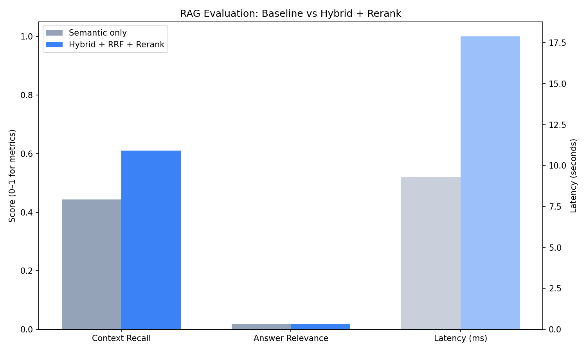

# PSA AI — Passive Safety RAG (v2)

Production RAG stack for passive safety regulations with **hybrid search** (semantic + BM25 + RRF), **BGE cross-encoder reranking**, **LangGraph** orchestration, **Guardrails AI**, **LangSmith** tracing, and **Grafana/Prometheus** monitoring. Scanned PDFs are ingested with **PaddleOCR / PP-OCR** and **hierarchical chunking**.

## Architecture

```
React/Next.js Frontend
        ↓
   API Gateway (nginx :8080)
        ↓
   FastAPI Backend (:8000)
        ↓
   LangGraph Workflow
   ├── Guardrails (input)
   ├── Hybrid Retriever (semantic + BM25 + RRF)
   ├── Cross-Encoder Reranker
   ├── Prompt builder
   ├── Groq LLM
   └── Guardrails (output: PII / unsafe warnings)
        ↓
   Response + observability
```

| Layer | Technology |
|--------|------------|
| Frontend | Next.js 14 |
| API Gateway | nginx |
| Backend | FastAPI |
| Orchestration | LangGraph |
| Embeddings (semantic) | `BAAI/bge-base-en-v1.5` (768-dim) |
| Sparse retrieval | BM25 (`rank_bm25`) |
| Fusion | Reciprocal Rank Fusion (RRF) |
| Reranker | `BAAI/bge-reranker-base` (cross-encoder) |
| LLM | Groq `llama-3.3-70b-versatile` |
| OCR ingestion | PaddleOCR / PP-OCR (RapidOCR ONNX fallback) |
| Observability | LangSmith (query, docs, prompt, response, latency) |
| Monitoring | Prometheus + Grafana (cost, latency, tokens, errors) |
| Evaluation | RAGAS + `tests/test_ragas_evaluation.py` |

> Retrieval is pure hybrid: dense (MiniLM) + sparse (BM25) fused with RRF, then
> cross-encoder reranking. The earlier GraphRAG path (Neo4j knowledge graph, KG
> extraction, community detection) was unused and has been removed.
> Note: `backend/app/graph/workflow.py` is the **LangGraph** orchestration graph,
> not GraphRAG.

## Quick start

### 1. Environment

```bash
cp .env.example .env
# Set GROQ_API_KEY (required for LLM responses)
# Optional: LANGSMITH_API_KEY, LANGSMITH_TRACING=true
```

### 2. Docker (full stack)

```bash
docker compose up --build
```

| Service | URL |
|---------|-----|
| App (gateway) | http://localhost:8080 |
| API docs | http://localhost:8080/docs |
| Grafana | http://localhost:3001 (admin/admin) |
| Prometheus | http://localhost:9090 |

### 3. Local development

ML deps (torch, sentence-transformers, paddle/rapidocr) live in a conda env named
**`rag`**. Run all Python from that env so the models resolve correctly.

```bash
conda activate rag
pip install -r requirements.txt

# Backend (run inside the rag env)
conda run -n rag uvicorn backend.app.main:app --reload --host 0.0.0.0 --port 8000

# Frontend
cd frontend && npm install && npm run dev
```

Frontend: http://localhost:3000

The frontend defaults to:

- `http://localhost:8000/api/v1` when running locally on port `3000`
- `/api/v1` when served through the gateway on port `8080`

You can override this with `NEXT_PUBLIC_API_URL`.

### Troubleshooting

**`ModuleNotFoundError: sentence_transformers` / `No module named 'rapidocr'`**
You are running anaconda *base* instead of the `rag` env. Use `conda run -n rag …`.

**Crash with exit code `0xC0000005` (Windows access violation)**
This is a torch/OpenMP DLL clash. The repo `.env` sets the fix:
```env
KMP_DUPLICATE_LIB_OK=TRUE
OMP_NUM_THREADS=1
```
For OCR, also use `OCR_BACKEND=rapidocr` (PP-OCR via ONNX) instead of native Paddle.

**Slow / empty chat**
1. Set **`GROQ_API_KEY`** in `.env` (required for answers).
2. If the embedding model still hangs, fall back to BM25-only:
   ```env
   DISABLE_SEMANTIC=true
   ENABLE_RERANKER=false
   ```
3. Restart backend; check `http://localhost:8000/api/v1/health` → `groq_configured: true`.

> Note: `BAAI/bge-reranker-base` runs on CPU (~10–30 s per query). For low-latency
> local chat, set `ENABLE_RERANKER=false` — the hybrid + RRF ranking is still used.

### 4. Verify retrieval & run evaluation

```bash
# Smoke-test the full chain (BM25 + semantic -> RRF -> BGE rerank)
conda run -n rag python scripts/verify_retrieval.py

# RAGAS-style evaluation: baseline (semantic-only) vs hybrid + rerank
conda run -n rag python tests/test_ragas_evaluation.py
```

Outputs:

- `output/rag_evaluation_results.json`
- `output/rag_evaluation_comparison.png`

## Project layout

```
AutoSafety_RAG/
├── backend/app/          # FastAPI + LangGraph + hybrid retrieval + reranker + guardrails
│   ├── retrieval/        #   hybrid.py (BM25+semantic+RRF), reranker.py (BGE)
│   ├── graph/            #   LangGraph workflow
│   ├── guardrails/       #   input/output validation
│   ├── core/             #   settings, services, observability (LangSmith)
│   └── metrics/          #   Prometheus metrics
├── frontend/             # Next.js UI
├── gateway/              # nginx API gateway
├── monitoring/           # Prometheus config + Grafana provisioning/dashboard
├── data/                 # PDFs + ingestion pipeline (paddle_ocr_converter, hierarchical_chunker, embed_chunks)
├── scripts/              # run_ingestion_pipeline.py, verify_retrieval.py
├── output/               # Markdown, chunks, embeddings, evaluation artifacts
├── config.py             # Shared model & path config
└── tests/                # RAGAS evaluation + test cases
```

## Offline data pipeline (PaddleOCR + hierarchical chunking)

Recommended pipeline for **scanned PDFs** (low memory on Windows):

```bash
pip install -r requirements.txt

# Full pipeline: PDF -> Markdown (PaddleOCR) -> hierarchical chunks -> embeddings
python scripts/run_ingestion_pipeline.py

# Faster dev run (UN R14 + R16 only):
python scripts/run_ingestion_pipeline.py --only UN_R14 UN_R16

# Reuse existing markdown, only re-chunk + embed:
python scripts/run_ingestion_pipeline.py --skip-docling
```

**PaddleOCR / PP-OCR** (default `OCR_ENGINE=paddle`):

| Technique | Setting | Purpose |
|-----------|---------|---------|
| Low-DPI page cache | `OCR_DPI=150` | Smaller PNGs in `output/page_cache/` |
| Small OCR batches | `OCR_BATCH_PAGES=4` | Process 4 pages, then `gc` — avoids OOM |
| Skip text pages | `OCR_SKIP_TEXT_PAGES=true` | Use embedded text when present |
| Windows fallback | `OCR_BACKEND=rapidocr` | PP-OCR via ONNX if native Paddle crashes |

`OCR_BACKEND`: `auto` | `paddle` | `rapidocr` (use `rapidocr` on Windows if you see exit code `0xC0000005`).

Alternative: `OCR_ENGINE=docling` or `OCR_ENGINE=pymupdf`.

Steps:

| Step | Script | Output |
|------|--------|--------|
| 1. OCR → Markdown | `data/docling_converter.py` → `data/paddle_ocr_converter.py` | `output/markdown/*.md` |
| 2. Hierarchical chunk | `data/hierarchical_chunker.py` | `output/regulation_chunks.json` |
| 3. Embed | `data/embed_chunks.py` | `output/regulation_embeddings.json` |

After ingestion, **restart the backend** to load new artifacts.

Set `EMBEDDING_BATCH=4` in `.env` if embedding still runs out of memory on CPU.

## Evaluation results

Latest run (`output/rag_evaluation_comparison.png`), 5 passive-safety test cases,
**baseline (semantic-only)** vs **hybrid + RRF + BGE rerank**:

| Metric | Semantic only | Hybrid + RRF + Rerank |
|--------|---------------|------------------------|
| Context recall (proxy) | 0.44 | **0.61** |
| Answer relevance (proxy) | 0.018 | 0.018 |
| Avg latency | ~9.3 s | ~17.9 s (BGE rerank on CPU) |

Hybrid retrieval + reranking improves **context recall by ~38%** over dense-only.
Full RAGAS metrics (faithfulness, answer_relevancy, context_precision) run when
`GROQ_API_KEY` is set and `ragas` + a LangChain LLM provider are installed; otherwise
offline proxy metrics are used. Raw numbers are in `output/rag_evaluation_results.json`.



## Observability & monitoring

The system emits two complementary signal streams:

### 1. Tracing — LangSmith (per-request detail)

`backend/app/core/observability.py` wraps the pipeline so each request records
**query → retrieved docs → prompt → response → latency** as a LangSmith run.

Enable it in `.env`:
```env
LANGSMITH_TRACING=true
LANGSMITH_API_KEY=ls__...
LANGSMITH_PROJECT=autosafety-rag
```
Traces appear at [smith.langchain.com](https://smith.langchain.com) under the project.
When disabled the wrappers are no-ops (zero overhead).

### 2. Metrics — Prometheus + Grafana (aggregate health)

The backend exposes Prometheus metrics at **`GET /metrics`** (defined in
`backend/app/metrics/prometheus.py`):

| Metric | Type | Meaning |
|--------|------|---------|
| `rag_request_duration_seconds` | histogram | end-to-end latency by endpoint/status |
| `rag_retrieval_duration_seconds` | histogram | hybrid retrieval latency |
| `rag_llm_duration_seconds` | histogram | Groq generation latency |
| `rag_tokens_prompt_total` / `rag_tokens_completion_total` | counter | token usage |
| `rag_estimated_cost_usd_total` | counter | cost proxy (Groq llama-3.3-70b rates) |
| `rag_errors_total{error_type}` | counter | error rate |
| `rag_guardrail_blocks_total{reason}` | counter | blocked prompts (injection/jailbreak) |
| `rag_active_requests` | gauge | in-flight requests |

**Flow:** `FastAPI /metrics` → Prometheus scrapes every 15 s
(`monitoring/prometheus.yml`) → Grafana auto-provisions the Prometheus datasource
and a dashboard (`monitoring/grafana/provisioning/`).

### How to visualize

```bash
docker compose up --build
```

| Tool | URL | Use |
|------|-----|-----|
| Grafana | http://localhost:3001 (admin/admin) | dashboards: latency, cost, tokens, errors |
| Prometheus | http://localhost:9090 | raw metric queries / ad-hoc PromQL |
| Raw metrics | http://localhost:8000/metrics | scrape endpoint |

The **"AutoSafety RAG"** dashboard loads automatically in Grafana. Useful PromQL:

```promql
# p95 end-to-end latency
histogram_quantile(0.95, sum(rate(rag_request_duration_seconds_bucket[5m])) by (le))

# estimated $/hour
rate(rag_estimated_cost_usd_total[1h]) * 3600

# error rate
sum(rate(rag_errors_total[5m]))
```

### Future visualization ideas

- **Alerting:** Grafana alert rules on p95 latency, error rate, or hourly cost
  (e.g. notify Slack when `rate(rag_errors_total[5m]) > 0`).
- **Retrieval-quality panels:** export per-query `semantic_count` / `bm25_count` /
  `rerank_score` as metrics to chart hybrid contribution and rerank lift over time.
- **RAGAS over time:** push `tests/test_ragas_evaluation.py` results into Prometheus
  (pushgateway) or a CI job to trend context recall / faithfulness per build.
- **Tracing dashboards:** connect LangSmith datasets to Grafana, or add OpenTelemetry
  spans for distributed traces across gateway → backend → Groq.

## Guardrails

- Blocks prompt injection & jailbreak patterns on input
- Warns on possible PII or unsafe content in responses

## License

Internal / research use — passive safety engineering assistant.
