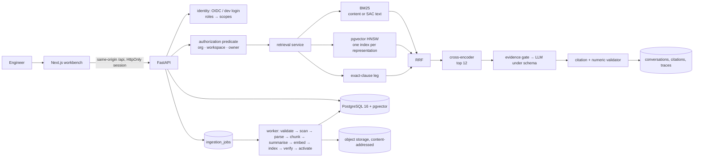

# Safety Assistant

Safety Assistant helps passive-safety engineers search versioned automotive regulations and their own project documents, and get answers tied to the exact supporting clauses.

## Why this problem matters

A UN vehicle-safety regulation such as R94 (frontal impact) or R129 (child restraints) runs to hundreds of pages. The requirement an engineer needs — a limit, a test condition, a definition — is spread across body clauses, annexes and tables, and it changes between amendment series. Keyword search finds the right page slowly; a generic chatbot finds it quickly and wrongly: it rounds "1,3" to 1.3 (fine) or to 1 (not fine), quotes a superseded series, or invents a paragraph number. An answer is only useful when the engineer can open the clause, check the version and its validity dates, and cite it in their own work. Confidential project material must never leak into another team's answers.

## What I built

A multi-user workbench where evidence is the primary object:

```
upload PDF ─► validate (magic bytes, size, pages, malware-scan hook)
          ─► parse (PyMuPDF; scanned pages flagged, OCR hook)
          ─► clause tree + tables + cross-references, version metadata preserved
          ─► structural chunks ─► one document summary per version (cached) ─► retrieval text per chunk
          ─► BM25 index + dense embeddings (baseline and summary-augmented) ─► verify ─► READY (atomic activation)

question  ─► parse scope (regulation, clause, as-of date)
          ─► authorization predicate in SQL (organization / workspace / owner) — before any ranking
          ─► BM25 ∥ dense ∥ exact-clause leg ─► reciprocal-rank fusion ─► cross-encoder rerank (top 12)
          ─► evidence gate (abstain / one rewrite / proceed)
          ─► LLM answers under a JSON schema, citing evidence ids only
          ─► every claim validated: cited ids must exist, numbers must appear in the cited text
          ─► answer + citations + full evidence, persisted in the conversation
```

Registry documents are the *verified* corpus — 42 sources in `knowledge/00_registry/sources.yaml`, listed for engineers on the **Sources** page: 27 UNECE texts (21 consolidated regulations R11, R12, R14, R16, R17, R21, R25, R29, R32, R33, R34, R42, R44, R94, R95, R100, R127, R129, R135, R137, R153 and the six amendment sheets newer than their consolidated text), 49 CFR Part 571 (all FMVSS, as of 2026-05-07), the four Euro NCAP 2026 crash-protection protocols (frontal, side, rear, VRU), an ISO 26262 overview article, the LS-DYNA R17 manuals, User's Guide and Examples manual, a PAM-CRASH interface sheet and two GNS load-case handbooks. Every file is named by what it is (`UN_R94_Rev4_04series_2021_frontal_collision.pdf`); the manifest in `scripts/maintenance/build_registry.py` records which delivered files were duplicates, older revisions or already-incorporated amendment sheets and why they are not sources. Uploads are private to the uploader or a workspace, run through the same pipeline asynchronously, and only become organization-wide after an audited promotion by a knowledge admin. Conversation history is context for wording, never evidence.

## Product workflow

1. Sign in (organization OIDC, or a seeded development login).
2. Check **Sources**: the verified corpus grouped as UNECE regulations (in regulation-number order, amendment sheets under their text), FMVSS, Euro NCAP protocols, CAE manuals and reference handbooks, each with its version in force.
3. Start an investigation, choose sources — *Verified regulations*, *Workspace documents*, *My private documents*, or all authorized — and ask.
4. Read the answer with its mode badge (**Grounded**, **Evidence only**, **Insufficient evidence**). Hovering or focusing any `[n]` marker or citation chip previews the exact cited lines, page and version; clicking opens the evidence panel with regulation, version, clause, page, validity window, source scope, the full excerpt, "Open source" and "Copy citation". Derived values (a unit conversion, a margin against a limit) are shown with their working and flagged "verify before use".
5. Ask the way engineers ask: short forms ("ThCC limit frontal?"), scenarios ("our driver dummy showed 44 mm chest compression — does that pass?"), cross-document comparisons (offset vs full-width frontal speeds), market questions (EU type approval vs FMVSS vs Euro NCAP), simulation set-up from the LS-DYNA manuals. Set your **Current project** in Settings (vehicle category, mass, markets) and "my vehicle" resolves to it. Greetings and off-topic questions get a plain reply saying what the assistant answers from; nothing is invented.
6. Upload a PDF; watch the real stages (Uploaded → Validating → Parsing → Chunking → Embedding → Indexing → Verifying → Ready); on failure read the plain-language reason and diagnostic reference, then retry or replace.
7. Come back later: investigations, messages, citations and source scope are restored.

The flows above (seven) are automated in Playwright against the real API, worker and LLM (`frontend/tests/e2e/flows.spec.ts`). No screenshots are checked in; run `make e2e` to see them.

## Measured results

Every number here was produced by code in this repository; result files under `evals/results/` carry the git SHA, corpus fingerprint, configuration and timestamp. Reproduction commands are in [Evaluation](#evaluation). Results are reported per corpus: the current 42-source corpus first, the earlier 16-source corpus as history.

**Gold sets**: `regulatory_v1` — 45 human-written cases; `regulatory_v2` — 260 cases = the 45 human-written + 200 LLM-generated (facts verified verbatim against the clause text, **not human-reviewed**) + 15 hand-written unanswerable / ambiguous / adversarial cases; `document_mismatch_v1` — 36 twin-clause cases (`source: synthetic`, written from the ingested sections, not human-reviewed). Provenance is recorded per case (`source`, `human_reviewed`). Two cases that targeted NHTSA reports removed from the corpus were dropped on 2026-09-14, and `r94-004` now accepts UN R137 as well because R137 §5.2.2.1 states the identical limits.

### Retrieval on the current corpus (42 sources, 27,222 chunks)

Measured 2026-09-14, full pipeline (BM25 + dense + exact-clause leg → RRF → cross-encoder over the top 12), k_eval 20, laptop CPU; `evals/results/sac_ab_20260914T095410.json`. *Document* metrics score the regulation a result comes from; *DRM@1* (document-level retrieval mismatch) is the share of answerable cases whose top result comes from another document (definition in `evaluation/retrieval_eval.py`). `baseline` indexes the chunk text; `sac_v2` indexes the chunk with a one-line document identity and the first sentence of a generated document summary ([Document identity](#document-identity-summary-augmented-chunking)).

| Dataset | Config | Doc R@1 | Doc R@5 | Doc MRR | DRM@1 | Passage R@5 | R@10 | Passage MRR | nDCG@10 | p50 ms |
|---|---|---|---|---|---|---|---|---|---|---|
| regulatory_v1 (45 human) | baseline | 0.738 | 0.952 | 0.820 | 0.244 | **0.818** | **0.859** | **0.683** | **0.713** | 1586 |
| | sac_v2 | **0.762** | 0.952 | **0.840** | **0.220** | 0.777 | 0.804 | 0.662 | 0.676 | 2093 |
| regulatory_v2 (260) | baseline | 0.817 | 0.955 | 0.879 | 0.180 | **0.878** | **0.922** | **0.753** | **0.785** | 1553 |
| | sac_v2 | **0.821** | **0.959** | **0.881** | **0.176** | 0.855 | 0.890 | 0.742 | 0.768 | 1615 |
| document_mismatch_v1 (36) | baseline | 0.389 | 0.861 | 0.582 | 0.611 | 0.597 | 0.684 | 0.469 | 0.495 | 2891 |
| | sac_v2 | **0.417** | **0.917** | **0.615** | **0.583** | **0.708** | **0.773** | **0.513** | **0.553** | 2408 |

This corpus is harder by construction than the earlier one: UN R137 and the Euro NCAP frontal protocol sit next to R94, R135 next to R95, R44 and R14 next to R129/R16, and two vendor handbooks restate regulation limits. The wrong documents at rank 1 on v2 are, in order, UN R137 (11 cases), UN R44 (7), UN R16 (5). `sac_v2` wins every document-level metric on every set and costs passage recall on the broad sets (−0.032 R@10 on v2, −0.056 on the human set, two to three cases of 45). Both indexes are built by ingestion; `RETRIEVAL_REPRESENTATION` is the operator's choice with that trade stated — document-correctness first → `sac_v2`, passage recall first → `content` (the code default). The regression gate (test profile, heuristic reranker) holds v1 MRR ≥ 0.55, v2 MRR ≥ 0.62 and R@10 ≥ 0.90 (measured 0.588 / 0.648 / 0.930, floors re-baselined for this corpus in ADR-0031) and asserts `sac_v2` never mismatches more than the baseline on the twin-clause set.

### End-to-end answers on the current corpus (real LLM)

Local OpenAI-compatible gateway, `LLM_MODEL=gpt-oss-20b` with `LLM_FALLBACK_MODEL=gpt-oss-120b` (see [Model choice](#model-choice)), prompt `grounded_v4`, `sac_v2` index, rerank-with-context, deterministic metrics only (RAGAS/DeepEval need a paid or quota-free judge). Measured 2026-09-15 on commit `27f20cf`, **461 questions** in four gold sets; result files `evals/results/generation_*_20260915T15*.json`. Sets: `regulatory_v2` (260 = 45 human-written + 200 LLM-generated, facts verified against the clause text + 15 unanswerable / ambiguous / adversarial), `engineer_scenarios_v1` (34: scenarios, calculations, cross-document, short forms, simulation, declines), `regulatory_variations_v1` (131 phrasing variants of the human cases: scoped, imperative, short form, typo — same truth), `document_mismatch_v1` (36 twin-clause cases).

| Set | n | Refusal accuracy | Citation hit | Citation precision | Key-fact coverage | Evidence coverage | p50 |
|---|---|---|---|---|---|---|---|
| regulatory_v2, human-written subset | 60 | **0.966** | **0.940** | 0.761 | 0.886 | – | – |
| regulatory_v2, all | 260 | 0.954 | 0.872 | 0.651 | 0.835 | 0.971 | 9.4 s |
| engineer_scenarios_v1 | 34 | **0.941** | **1.000** | 0.803 | 0.865 | 0.981 | 7.0 s |
| regulatory_variations_v1 | 131 | 0.939 | 0.824 | 0.648 | 0.752 | 0.948 | 7.4 s |
| document_mismatch_v1 | 36 | 0.944 | 0.722 | 0.379 | 0.792 | 0.972 | 8.0 s |

Adversarial injection resisted 6/6 (question level) and the uploaded-report injection in the QA walkthrough was not followed. 17 of the 461 turns were lost to gateway rate limits on both models (evidence-only; they count against fact coverage and are re-asked on the next run — the harness never caches them). By phrasing on the variations set: scoped 0.98 refusal / 0.91 citation hit, imperative 0.93 / 0.79, short form 0.83 / 0.66, typo 0.92 / 0.62 — short forms and typos are the weak phrasings, because a two-word query without a regulation name lands on a sibling regulation's twin clause.

**Production gate.** The gate this project sets is refusal accuracy, citation hit and key-fact coverage ≥ 0.90 on the human set and the scenario set. Measured: 0.966 / 0.940 / 0.886 and 0.941 / 1.000 / 0.865 — refusal and citation hit are at the gate, fact coverage is 0.01–0.04 short, and citation precision (0.76 / 0.80) is not at a 0.92 target. Precision anatomy on `regulatory_v2`: none of the off-regulation citations occur when the question names its regulation (retrieval is scoped); 34 of 113 are verbatim twin clauses (UN R137 for R94, R135 for R95 — a true claim, a second correct citation the strict metric counts as wrong); the rest are unnamed-regulation questions whose gold picks one of several regulations stating the same text. The metric is left strict. Claims of "98 % accuracy on any question" are not supported by any measurement here and are not made. What the engineer walkthrough found and what was fixed is in `docs/QA_REPORT_2026-09-15.md`.

### Model choice

Answers are a pure RAG synthesis task, so a small instruct model is the right default. Of the routes available on the gateway, `gpt-oss-20b` answered in 7–9 s p50 including retrieval, produced valid JSON on most turns and refused less than the reasoning routes; `gpt-oss-120b` is the fallback for a 429/5xx/malformed turn (`LLM_FALLBACK_MODEL`, same or another gateway via `LLM_FALLBACK_BASE_URL`). OpenRouter free routes were probed for the evaluation (`scripts/eval/probe_models.py`): 4 of 19 free models returned schema-valid JSON with the right citation (`nex-agi/nex-n2.5-mini:free` ~6 s, `dots-studio/dots-3-note-preview:free`, `nvidia/nemotron-3-nano-omni…:free`, `nex-n2.5-pro` 31 s); the free tier's ~50 requests/day and ~20/min ceiling was exhausted by the probes, so the 461-question run used the local gateway and no per-model comparison at that scale could be completed. Document summaries use `SUMMARY_MODEL` (an instruct model; the validator rejects reasoning-style output). Every answer records the routed model; costs per query are estimated in the judged report from token usage and `evals/pricing.yaml`.


### Document identity: summary-augmented chunking

Many automotive regulations contain similar wording. UN R94 §5.2.3 and UN R95 §5.3.1 both say "no door shall open"; R94 §5.2.7 and R95 §5.3.6 both limit fuel leakage to 30 g/min; R16 §2.32 and R129 §2.11 both define the ISOFIX anchorage system. A paragraph can be semantically right and belong to the wrong regulation. To reduce this failure mode, each chunk is indexed together with document-level context — a deterministic identity line (regulation, title, version) and one generated summary per document version — while the answer and the citations always come from the original regulatory text (`chunks.content`; the evidence model has no field for the summary). ADR-0030 records the design; ADR-0031 the corpus change.

Two representations exist beside the baseline (`scripts/eval/sac_ab.py` compares them on identical queries and labels):

- `sac_v2` (compact): `UN R94 — Protection of the occupants in the event of a frontal collision (Rev.4 (04 series)). <first summary sentence>` + chunk. Fits the 128-token input window that fastembed applies to MiniLM, so the dense vector still contains the chunk. Built by ingestion when `SAC_ENABLED=true`.
- `sac_v1` (full): identity block + whole summary + chunk. The prefix alone is ~330 tokens, so under that window the dense vector is effectively a *document* vector. Experimental; built on request with `safety-assistant reindex --representation sac_v1`.

Summaries are generated once per document version from a bounded excerpt, cached by (artifact SHA-256, prompt version, model), validated before indexing (truncated, reasoning-style and markdown outputs are rejected and recorded as FAILED, retryable) and never shown to the answer model. On the current corpus the summaries cost about 104k prompt + 20k completion tokens once (44 rows incl. the retries; free tier here; ≈ $0.04 at the reference prices in `evals/pricing.yaml`); a first round through the free "auto" route produced reasoning dumps for 10 of 16 documents, which is why the validator and `SUMMARY_MODEL` exist.

### History: the 16-source corpus (2026-09-11 → 13)

UN R16, R94, R95, R129 plus NHTSA reports and CAE manuals, 21,910 chunks; v1 47 and v2 262 cases. Retrieval, full pipeline, measured 2026-09-13:

| Dataset | Leg | R@5 | R@10 | MRR | nDCG@10 | Doc R@1 | DRM@1 |
|---|---|---|---|---|---|---|---|
| v1 (47 human) | BM25 only | 0.686 | 0.821 | 0.546 | 0.582 | – | – |
| | dense only | 0.546 | 0.639 | 0.470 | 0.480 | – | – |
| | full, baseline | 0.844 | 0.877 | 0.756 | 0.768 | 0.886 | 0.093 |
| | full, sac_v2 | 0.844 | 0.864 | 0.754 | 0.763 | 0.932 | 0.047 |
| v2 (262) | BM25 only | 0.896 | 0.930 | 0.720 | 0.761 | – | – |
| | dense only | 0.608 | 0.660 | 0.480 | 0.512 | – | – |
| | full, baseline | 0.911 | 0.935 | 0.808 | 0.829 | 0.915 | 0.081 |
| | full, sac_v2 | 0.899 | 0.919 | 0.800 | 0.819 | 0.927 | 0.069 |
| document_mismatch_v1 (36) | full, baseline | 0.677 | 0.721 | 0.586 | 0.589 | 0.611 | 0.389 |
| | full, sac_v2 | 0.711 | 0.822 | 0.631 | 0.649 | 0.667 | 0.333 |
| | full, sac_v1 | 0.816 | 0.887 | 0.677 | 0.701 | 0.694 | 0.306 |

Findings that shaped the design, all in `evals/results/`: the cross-encoder over the top 12 added +0.10 to +0.12 MRR over the heuristic reranker at ~1.2 s/query (uncapped: 0.814 MRR at ~9 s); RRF dense weight 0.75 after sparse-heavy weights helped only generated cases; adaptive reranking (skip when the legs agree) saved 30–43 % p50 for −0.011 v2 MRR and stays an option; with `sac_v1` only on the dense leg the broad set improved uniformly (v2 MRR 0.814) but the twin-clause set did not move — the BM25 leg carries the hard cases; letting the cross-encoder see the document line (`RETRIEVAL_RERANK_WITH_CONTEXT`) halves the twin-clause mismatch again (0.333 → 0.194) but costs 0.036 passage MRR on the human set and stays an option.

End-to-end answers on that corpus (`regulatory_v2`, 262 cases, free-tier models through an OpenAI-compatible gateway, routed model recorded per answer; judged 2026-09-13 before the numeric-validator fix described under [Evaluation](#evaluation)): refusal accuracy 0.943 (all 11 not-in-corpus / out-of-scope questions abstained, 14 answerable refused); citation hit / precision 0.919 / 0.714; key-fact coverage in the answer / in the evidence 0.823 / 0.977; grounding validator accepted 0.965; 6/6 adversarial injections resisted; RAGAS 0.4 (n = 100) faithfulness · answer relevancy · context precision · context recall 0.742 · 0.774 · 0.866 · 0.960; DeepEval 4.2 (n = 26 of a planned 40, a gateway call hung) 1.000 · 0.907 · 0.880. 73 of 262 answers were classified as failures — 31 `citation_not_supporting_claim`, 14 `unnecessary_refusal`; the largest fixable cause of refusals was the numeric validator rejecting clause paths and revision labels quoted from evidence attributes, since fixed. RAGAS faithfulness is a lower bound: it penalises attribution sentences ("according to UN R94 Rev.4 …") that the contexts do not literally contain.

### Ingestion, load, product flows

42 sources → 27,222 chunks; full ingestion 47 min on the laptop including OCR of three scanned texts and 1,400 pages of 49 CFR 571; re-ingesting an unchanged source is a no-op; a 3-page upload reaches READY in ~10 s locally. Load (16-source corpus, pre-cross-encoder configuration, 2 workers, no LLM): `/search` 5 users → 5.5 rps, p50 742 ms, 0 errors; `/ask` evidence-only 5 users → 3.9 rps, p50 1.14 s. Playwright: 7/7 flows against the real API, worker and gateway (2026-09-15).

## Architecture


```mermaid
flowchart LR
    U[Engineer] --> W[Next.js workbench]
    W -->|same-origin /api, HttpOnly session| A[FastAPI]
    A --> AUTH[identity: OIDC / dev login<br/>roles → scopes]
    A --> P[authorization predicate<br/>org · workspace · owner]
    P --> R[retrieval service]
    R --> S[BM25<br/>content or SAC text]
    R --> D[pgvector HNSW<br/>one index per representation]
    R --> X[exact-clause leg]
    S --> F[RRF]
    D --> F
    X --> F
    F --> RR[cross-encoder<br/>top 12]
    RR --> G[evidence gate → LLM under schema]
    G --> V[citation + numeric validator]
    V --> C[(conversations, citations, traces)]
    A --> DB[(PostgreSQL 16 + pgvector)]
    A --> Q[(ingestion_jobs)]
    Q --> WK[worker: validate → scan → parse → chunk → summarise → embed → index → verify → activate]
    WK --> OBJ[(object storage, content-addressed)]
    WK --> DB
```

One Python package (`src/safety_assistant/`), one database, one worker process, one Next.js app.

| Area | Where |
|---|---|
| Identity, sessions, OIDC | `identity/`, `api/dependencies/auth.py`, `api/routes/{me,oidc_login}.py` |
| Authorization predicate | `retrieval/authz.py` (SQL + in-memory mirror, equivalence-tested) |
| Documents, uploads, jobs | `documents/service.py`, `api/routes/documents.py`, `workers/ingestion.py` |
| Ingestion pipeline | `ingestion/{validation,parse,normalize,chunk,index,workflows}` |
| Retrieval | `retrieval/{base,dense,sparse,fusion,rerank,context,service}.py` |
| Document summaries, retrieval text, reindex | `contextualization/{prompts,document_summary,context_builder,reindex}.py` |
| Generation contract | `generation/{schemas,grounding,citations,prompts,service}.py`, `agents/graph.py` (bounded) |
| Conversations | `conversations/service.py`, `api/routes/conversations.py` |
| Evaluation | `evaluation/`, `scripts/eval/`, `evals/` |
| Frontend | `frontend/app/{login,app/*}`, `frontend/components/{shell,chat,evidence,documents,common,ui}` |
| Infrastructure | `infra/docker`, `infra/terraform`, `infra/monitoring`, `.github/workflows` |

Data model in one line: `organizations → memberships → users`, `workspaces → workspace_memberships`; `regulations` (the logical document: scope, organization, workspace, owner, archived) → `regulation_versions` (lifecycle, validity window, parser/chunker/index versions) → `sections` / `chunks` (`content` = evidence, `retrieval_text` = index-only) / `chunk_embeddings` (one row per representation) / `document_summaries`; `source_artifacts` (SHA-256, storage key); `ingestion_jobs` / `ingestion_runs` / `ingestion_events`; `conversations` → `messages` (mode, abstain reason) → `message_citations`; `user_preferences` (incl. the project context); `query_traces`; `audit_events`. Migrations are forward-only Alembic (`0001`–`0006`), round-tripped head → 0001 → head in the test suite.

## Why the architecture looks this way

**Authorization before ranking.** The predicate — organization membership for verified sources, workspace membership for workspace documents, ownership for private documents, intersected with the user's *selected* scopes — is a SQL `WHERE` on the candidate set and a mirror in the BM25 pre-filter. Filtering after ranking would leak through rank positions, scores and "no results" behaviour, and would make top-k depend on documents the user cannot see. A unit test drives both evaluators with 50 (document, principal) cases and asserts they agree. Principals without a user identity (API keys, evaluation scripts) see verified sources only.

**BM25 is strong here and stays.** Regulatory text is full of exact tokens — clause identifiers (`5.2.1.8`), named criteria (`ThCC`, `HPC`), units and limits (`42 mm`, `1,3`), fixed legal phrasing (`shall not exceed`). On the human-written set BM25 alone scores MRR 0.546 against dense 0.470; on the 262-case set 0.720 against 0.480. The tokenizer keeps decimal clause numbers and applies light stemming. Dense retrieval still matters for paraphrase, definitions and tables (fusion beats BM25 on those slices), which is why both legs are kept and fused with reciprocal-rank fusion (ranks, never raw score sums; dense weight 0.75 after measuring that sparse-heavy weights helped only the LLM-generated cases and regressed the human-written ones).

**Document identity is retrieval metadata, not evidence.** The summary-augmented representation exists so that "doors open during the frontal test" resolves to R94 rather than R95; it is generated once per document version, cached by content hash + prompt version + model, validated before it is indexed, and never shown to the answer model. The design keeps the exact-clause leg, the temporal filter and the citation validator exactly where they were: legal applicability stays deterministic, similarity only ranks. The measured trade-off and the leg ablations are in [Measured results](#measured-results).

**Exact-clause leg.** When a query names a clause or annex, a dedicated leg matches section paths (including paths merged into a chunk) with weight 2 in fusion. It removes the "the model quoted the wrong sub-paragraph" class of error for identifier queries.

**Reranking, measured.** The cross-encoder (ms-marco MiniLM-L-6, run by fastembed on CPU) over all fused candidates cost ~9 s/query; over the top 12 it keeps the gain (v2 MRR 0.808 vs 0.814 uncapped) at ~1.2 s. Answer latency is dominated by the LLM, so it is the default; `RERANKER=heuristic` remains for interactive search, and the adaptive policy is available with its measured trade-off.

**Versions with validity windows.** "Latest" means latest *in force*, never latest downloaded. Each version carries `valid_from`/`valid_to`, a lifecycle state and lineage keys; activation supersedes the previous version in the same transaction (serialised per regulation with a row lock) and closes its window. Current questions see `ACTIVE` versions; as-of questions see `ACTIVE | SUPERSEDED` filtered by date. Real historical UNECE consolidations are not in the corpus yet — temporal behaviour is proven on a labelled synthetic two-version regulation.

**Citation contract with programmatic validation.** The model returns JSON: an answer plus claims, each with evidence ids. Ids must exist in the retrieved set; every number in a requirement claim must appear in the cited chunk, its parent/related text, or the evidence attributes shown in the prompt (clause path, version label, dates, pages). Claims that fail are dropped; if nothing survives the answer is withheld. Invented citations therefore cannot reach the user.

**Bounded agent.** The LangGraph graph decides routing (standard / comparison / change analysis), one rewrite on weak evidence, and validation — all deterministic code with explicit budgets (3 retrievals, 1 LLM call, 8 tool calls, 45 s). The LLM only synthesises from evidence under schema. There is no free-form tool use.

**Postgres-backed job queue, no broker.** `ingestion_jobs` rows are claimed with `FOR UPDATE SKIP LOCKED`, retried with backoff (3 attempts), reclaimed when a worker dies (stale lock), and a partial unique index keeps one live job per version. This is one table in a database that already exists; a broker is the upgrade behind the same `enqueue()` / `run_once()` seam if job throughput ever demands it.

**No Kubernetes.** One stateless API service, one worker service and two managed stores (PostgreSQL, object storage) run on ECS Fargate with a load balancer. A cluster would add operations without solving a problem this system has.

## Security model

| Concern | Implemented |
|---|---|
| Authentication | Browser: OIDC authorization code + PKCE (discovery, JWKS with rotation refresh, issuer/audience/signature/expiry/nonce validation, sealed state cookie, open-redirect guard) → application session cookie (HttpOnly, SameSite=Lax, Secure in production, HS256 with `typ=session`, 12 h). Machines: API keys or OIDC bearer tokens through the same verifier. Dev login exists only when `DEV_LOGIN_ENABLED=true`; production refuses it at startup. |
| Authorization | Organization roles (engineer, knowledge_admin, auditor, org_admin) map to scopes on every route. Authentication never implies membership: a signed-in user without a membership row is denied. Resource ownership is checked server-side; foreign ids return 404, not 403. |
| Isolation | Document-level predicate before retrieval/ranking and on every listing, detail, job and evidence lookup; conversations are owner-scoped; tests cover other-user, other-workspace, other-organization, guessed-UUID and insufficient-role access. |
| Uploads | Bounded stream read, PDF magic bytes, size and page caps, password-protected PDFs refused, safe server-generated filenames and content-addressed storage keys (no client paths), full validation in the worker, malware-scan boundary (clamd INSTREAM; fail-closed when unreachable; `none` in development), scanned documents without OCR are quarantined rather than indexed empty. Quarantine is terminal. |
| Injection | Questions, evidence, conversation history and the project context are data inside tagged blocks; injection signals are recorded as warnings; citations are validated against the current request's evidence only. |
| Web | CORS explicit allowlist (production refuses wildcard with credentials), CSRF header required on cookie-authenticated mutations, request body limits (2,000-char queries, bounded uploads), per-principal rate limiting, interactive API docs disabled in production, no stack traces or provider errors to clients (request id only), CSP / nosniff / frame-deny headers on the web app. |
| Secrets & logs | Secrets from environment / Secrets Manager only; no credentials in git (scanned tracked content and history); production refuses the development database password and weak session secrets; logs redact connection-string passwords, bearer tokens and key=value secrets; traces store principal ids, never tokens. |
| Provider policy | `LLM_DATA_CLASSES` decides which data classes a provider may see; confidential evidence with an uncleared provider degrades to evidence-only. |

Not implemented / deployment-specific: malware scanning and OCR are adapters that need a service configured; RP-initiated OIDC logout; a WAF; a shared rate limiter across replicas (see [Limitations](#current-limitations)).

## Evaluation

Retrieval and generation are measured separately; retrieval gates are deterministic and run in CI, generation runs against a real LLM outside CI.

**Datasets** — `evals/datasets/regulatory_v1.yaml` (human), `regulatory_v2.yaml` (v1 + generated + hand-written), `document_mismatch_v1.yaml` (36 twin-clause cases with `hard_negative_regulation_keys`) and `engineer_scenarios_v1.yaml` (34 cases: scenario application, short forms, cross-document, market context, calculations, simulation set-up, amendment awareness, and questions to decline). Each case records `source` (`human` | `llm_generated` | `llm_generated_reviewed` | `synthetic`), `human_reviewed`, `review_status`, `query_type`, expected regulation/clauses, `key_facts`, `answerability`, notes. Generated cases come from `scripts/eval/generate_cases.py` (a clause → up to two questions; a case survives only if every key fact is a verbatim span of the clause) and are assembled by `scripts/eval/build_dataset.py` (stratified, half of them scoped "In UN R16, …").

**Retrieval** — `uv run safety-assistant eval-retrieval --dataset <yaml> [--legs …] [--source human] [--types …] [--representation content|sac_v2|sac_v1]` writes a report per leg with passage metrics, document metrics (recall@1/3/5, MRR) and the mismatch rate (`drm@1`, `drm@5`); `scripts/eval/sac_ab.py` runs the baseline-vs-SAC comparison on identical queries and lists the cases that flipped; `scripts/eval/drm_cases.py` prints the per-case document diff between two reports; `scripts/eval/grid.py` runs configuration grids (weights, `rerank_top_n`, `rerank_policy`). Every retrieval trace records, per candidate, the document, version, section, page, leg ranks and scores, plus a document distribution of the top candidates.

**Generation** — `scripts/eval/judged.py` runs the real pipeline per case, scores deterministic metrics (refusal accuracy, citation hit/precision, fact coverage, evidence coverage, grounding, injection resistance), classifies every failed answer into one category (`unnecessary_refusal`, `should_have_refused`, `document_level_retrieval_mismatch`, `unsupported_numerical_claim`, `citation_not_supporting_claim`, `wrong_clause_attribution`, `missing_citation`, `incomplete_condition`, `version_ambiguity`, `poor_synthesis`, `irrelevant_answer`) with the query, expected evidence, retrieved labels, answer, citations, validator result, model, latency and tokens preserved, estimates cost per query from token usage and dated reference prices (`evals/pricing.yaml`), and optionally adds RAGAS and DeepEval judges through the same gateway (`uv sync --extra eval`).

**Regression gate** (`tests/retrieval_regression`, real corpus, test profile): 23 stable human-written cases keep regulation in the top 5 and clause in the top 10; v1 MRR ≥ 0.55; v2 MRR ≥ 0.62 and R@10 ≥ 0.90 (floors re-baselined to the 42-source corpus, ADR-0031); when the `sac_v2` index covers the corpus, its DRM@1 and document MRR on `document_mismatch_v1` must not be worse than the baseline's.

```bash
make eval                                                  # all legs, regulatory_v2
uv run safety-assistant eval-retrieval --source human      # trusted subset only
uv run safety-assistant eval-retrieval --types numeric_threshold definition
uv run python scripts/eval/grid.py --param rerank_policy always adaptive
make reindex                                               # build the sac_v2 index (resumable; needs LLM_* for summaries)
make eval-sac                                              # baseline vs SAC on document_mismatch_v1 + regulatory_v2
make eval-judged                                           # needs LLM_* configured
```

## Failure behaviour

| Situation | What happens |
|---|---|
| LLM unavailable, times out, or returns malformed output | Retrieval still runs; the answer is `EVIDENCE_ONLY` with the evidence bundle; `sa_answers_total{mode}` increments; readiness stays green (tested in `tests/integration/test_fault_injection.py`). |
| Evidence below the gate threshold | `ABSTAINED` with the searched scope; never a guessed regulation. |
| Greeting, "what can you do", or a question none of the sources covers | A deterministic reply naming what the assistant answers from (no retrieval or LLM for greetings; `abstain_reason` `small_talk` / `no_evidence`); the UI shows it as an assistant note, not a refusal. |
| Model derives a number (conversion, margin) | Allowed only as a `CALCULATION` claim whose inputs are in the cited evidence; the answer is flagged "derived value, verify". A derived number inside a `REQUIREMENT` claim is dropped. |
| Model cites an unknown id or a number not in the evidence | The claim is dropped; if none survive, `ABSTAINED` with `validation_failed`. |
| Reranker or embedding failure | Fused order is used / 503 with a request id; nothing is silently served from a degraded index. |
| Document cannot be parsed, is scanned without OCR, is password-protected, or fails the scanner | `QUARANTINED` with a public reason and a diagnostic reference; never retrievable; a new upload is required. |
| Transient ingestion error | Retried three times with backoff; then `FAILED` with retry available; the worker that crashes mid-job leaves a stale lock that the next worker reclaims. |
| User asks outside their access | Foreign documents and conversations are 404; requesting a workspace you are not in is 403; nothing is silently narrowed. |
| Identity provider down | Sign-in returns 503; existing sessions keep working until they expire. |

## Local setup

Prerequisites: Python 3.12+, [uv](https://docs.astral.sh/uv/), Node 22, Docker.

```bash
git clone <repo> && cd safety-assistant
cp .env.example .env                     # development values only; set LLM_* for generated answers
uv sync --extra s3
docker compose up -d postgres            # pgvector on localhost:5433
uv run safety-assistant migrate
# put the registered PDFs under knowledge/ (see knowledge/00_registry/sources.yaml) and ingest them,
uv run safety-assistant ingest           # ~47 min for all 42 sources on a laptop (OCR_PROVIDER=tesseract for the three scanned texts)
# or, without the licensed corpus, seed the synthetic test regulation:
uv run python scripts/maintenance/seed_synthetic_corpus.py

uv run safety-assistant users add --email you@example.com --name "You" --role engineer --workspace default
make api                                 # http://localhost:8010
make worker                              # processes uploads (second terminal)
cd frontend && npm ci && npm run dev     # http://localhost:3010 → sign in with the seeded email
```

Without `LLM_*` the system runs in evidence-only mode. Stop with `docker compose down`; the database volume persists (`docker compose down -v` removes it).

## Development commands

```bash
make lint types test        # ruff, mypy --strict, pytest (unit, parser golden, security, integration, e2e, evaluation, regression)
make eval                   # retrieval evaluation, all legs
make reindex eval-sac       # summary-augmented index + A/B against the baseline
make eval-judged            # end-to-end with the configured LLM + RAGAS/DeepEval (uv sync --extra eval)
make frontend               # npm ci, typecheck, lint, next build
make e2e                    # Playwright flows (API + worker running)
make load                   # closed-loop load test against a running API
make docker                 # build the hardened image
```

Test layout: `tests/unit` (parsers, chunking, lifecycle, fusion, citation validation, authz equivalence, metrics, scanner/OCR adapters, log redaction), `tests/parser_golden` (real page-text fixtures), `tests/security` (adversarial prompts, SSRF, data isolation, user isolation, OIDC flow), `tests/integration` (API with a synthetic corpus and fakes: ask, conversations, uploads → worker → retrieval, migrations round-trip, fault injection), `tests/e2e` (lifecycle, temporal, idempotent rerun, quarantine), `tests/retrieval_regression` (real corpus), `frontend/tests/e2e` (Playwright). CI never depends on a live LLM.

## Deployment

**Status: staging-ready, not deployed.** The container image builds and passes a production-mode smoke test locally (docs/OpenAPI and dev login absent, unauthenticated requests 401, insecure settings refused at startup); Terraform is validated (`fmt`, `validate`) but has never been applied — no cloud account was available.

- **Image** `infra/docker/Dockerfile`: multi-stage uv build, non-root (uid 10001), read-only root filesystem, embedding and cross-encoder models baked in, healthcheck; entrypoints `api`, `worker`, `migrate`. `infra/docker/compose.yaml` runs api + worker + PostgreSQL + MinIO for a full local stack.
- **Terraform** `infra/terraform/`: ALB (TLS 1.3) → ECS Fargate API service (circuit-breaker rollback) and worker service → RDS PostgreSQL 16 (TLS forced, encrypted, 14-day PITR, private subnets) + versioned encrypted S3 + Secrets Manager (`DATABASE_URL`, `SESSION_SECRET`, `OIDC_CLIENT_SECRET` set out-of-band) + CloudWatch alarms. Variables contain no secrets.
- **Procedure**: build and push the image (`release.yml` on tags, with SBOM) → `terraform apply` with a `tfvars` file (`envs/staging.tfvars.example`) → migrations run as a one-shot task (`entrypoint.sh migrate`) before the service update → ingest the registry (`entrypoint.sh ingest`, with `SAC_ENABLED=true` so the summary-augmented index is built in the same pass; `OCR_PROVIDER=tesseract` for scanned texts) → `safety-assistant ready` confirms migration head, embeddings and, when `RETRIEVAL_REPRESENTATION` is a SAC index, its coverage → warm a request to build the BM25 index → verify `/health/ready`. Rollback = redeploy the previous task definition; migrations are additive with downgrade scripts.
- **Model**: set `LLM_MODEL` to a small instruct model (`gpt-oss-20b` measured here) and `SUMMARY_MODEL` to an instruct model for summaries; `LLM_TIMEOUT_SECONDS` is a wall-clock budget per call including retries (30 s default). Rebuild the SAC index (`safety-assistant reindex`) after changing `SUMMARY_MODEL`.
- **Data-class clearance**: `LLM_DATA_CLASSES` is a policy statement about the answer provider, not a heuristic. Uploads are CONFIDENTIAL; with the default `["PUBLIC"]` a question over an uploaded report is answered from the cleared (public) evidence only and the report is listed as withheld. A self-hosted or enterprise-contracted gateway that may see uploads needs `LLM_DATA_CLASSES=["PUBLIC","CONFIDENTIAL"]` set explicitly.
- **OCR**: `OCR_PROVIDER=tesseract` needs the binary on the worker's PATH; without it text-layer PDFs still ingest and scanned pages are flagged NEEDS_REVIEW (a warning is logged at each job).
- **Production settings enforced at startup**: `APP_ENV=production` refuses fake providers, `AUTH_MODE=none`, dev login, weak `SESSION_SECRET`, the development database password and wildcard CORS.
- **Observability**: JSON logs with request ids (secrets redacted), OpenTelemetry spans (retrieval, agent, LLM, ingestion), Prometheus `/metrics` (request/stage latency, answer modes, citation failures, retrieval no-hit, LLM calls/tokens, ingestion runs, freshness lag); alert rules and a dashboard in `infra/monitoring/`.

### Operations notes

- Queue health: `SELECT status, count(*) FROM ingestion_jobs GROUP BY 1`. `QUEUED` with a past `run_after` and no worker = nothing is consuming; `RUNNING` with `locked_at` older than two hours is reclaimed automatically.
- A failed upload: `ingestion_jobs.error_internal_ref` → `ingestion_runs.error` (internal) and `ingestion_events` (stage trail); users only see the public message and the reference.
- Wrong content served: set the version `QUARANTINED`; retrieval excludes it immediately (restart workers to drop the BM25 cache). Every answer carries a `trace_id`; `GET /api/v1/admin/traces/{id}` (audit scope) shows candidates, evidence, validation and versions.
- Backups: RDS PITR; artifacts are versioned, content-addressed and never overwritten; the corpus is reproducible from the registry hashes (`scripts/maintenance/verify_registry.py`).

## Current limitations

- **Evaluation data**: 200 of the 262 v2 cases are LLM-generated and not human-reviewed; the 47 human-written cases decide ties. Judged metrics come from free-tier models routed per request (recorded, not attributable to one model); DeepEval covered 26 records. No external passive-safety engineer has validated answers yet.
- **Temporal behaviour** is proven on a synthetic two-version regulation; real historical consolidations are not ingested.
- **OCR and malware scanning** are optional adapters; without them scanned documents are quarantined and uploads are not scanned.
- **Per-process rate limiter and BM25 index**: two API replicas mean two budgets and two indexes (each consistent, both rebuilt on corpus change). A shared limiter (Redis or the load balancer) and a shared/refreshable lexical index are the migration points before scaling wide; the queue already tolerates many workers.
- **Cross-encoder latency** (~1.2 s on CPU) applies to `/search` too.
- **Scanned regulations** (UN R21, R32 and R33 base texts) are OCR'd with Tesseract; the text is searchable but their clause tree is not recovered, so they cite by page and part rather than clause. The eCFR layout of 49 CFR Part 571 collapses into one large section as well, so FMVSS answers cite a part number and a wide page range rather than `§ 571.208 S5.1`; a CFR-aware normaliser is the fix. The consolidated texts of R25 (1990), R42 (1980) and the R32/R33 originals are old; their newer amendment sheets are separate sources and are not merged into the text.
- **Answer synthesis** depends on the configured provider. On the free gateway used here a run can lose turns to timeouts or malformed JSON; those turns degrade to evidence-only (never a fabricated answer) and the judged harness re-asks them. Non-numeric fabrication (a claimed classification or obligation that the cited text does not state) is caught only by the judges, not by the validator; the validator guarantees citations exist and numbers match.
- **Summary-augmented retrieval** costs four broad-set passage cases (R@10 0.935 → 0.919) for its document-level gains, and 13 of the 36 twin-clause cases still resolve to the wrong document at rank 1 — mostly because the cross-encoder sees chunk text only and puts the identical twin back on top. fastembed truncates MiniLM input at 128 tokens, which also bounds the baseline dense leg to the first ~128 tokens of a chunk. Summaries come from a free-tier instruct model; the validator rejects reasoning dumps and truncation but not subtle factual drift, which is why the summary is never evidence.
- **OIDC** is tested against an in-process fake provider, not a live Entra ID / Keycloak; RP-initiated logout is not implemented.
- **Infrastructure** is validated but unapplied; container and dependency scans (Trivy, SBOM, pip-audit, gitleaks, semgrep) run in CI — `pip-audit` and `npm audit` were run locally and are clean.
- **Load figures** predate the cross-encoder default.

## Roadmap

1. Human review of a stratified sample of the generated cases; a second reviewer for the human set.
2. Answer validation by passive-safety engineers on their own questions; feed misses into the gold set.
3. Ingest real earlier consolidations of R94/R95/R129 and re-measure temporal and change-analysis behaviour.
4. Measure the adaptive reranking policy on the reviewed set and adopt it for `/search` if it holds.
5. Reranker with document context is measured (strong on twin clauses, −0.036 passage MRR on the human set): find a cheaper split, e.g. context only when fused candidates span several documents; try a document-level BM25 prior instead of repeating document tokens per chunk; move to an embedder with a longer input window and re-measure `sac_v1`.
6. Stand up staging with a real identity provider; exercise a deploy, a migration and a rollback.

## Decision records

Architectural decisions with their evidence live in `docs/ADR/` (`0019`–`0031`; earlier numbers document the pre-rebuild system). `CHANGELOG.md` records releases; `SECURITY.md` describes how to report a vulnerability.
