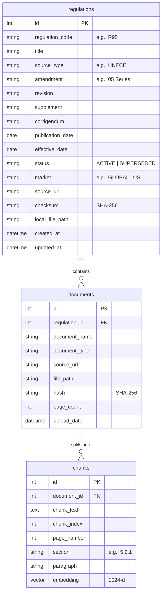
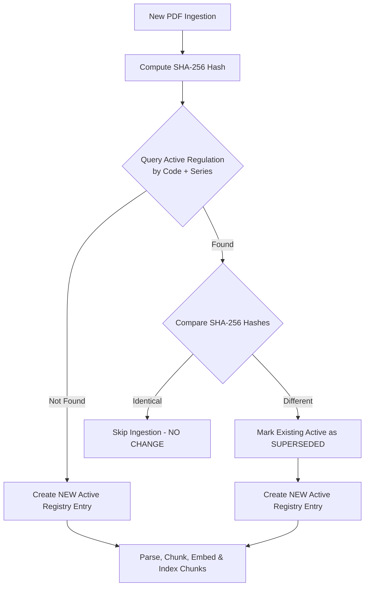

# Automotive Safety Regulation Registry System Documentation

This document describes the design, database schema, workflow pipelines, and verification procedures for the **Automotive Safety Regulation Registry** integrated into the root of `h:\AutoSafety_RAG`.

---

## 1. System Architecture

The registry system uses a modular, decoupled architecture to support passive safety engineers and future multi-agent RAG platforms:

* `/app`: App initialization, lifespan events, and configuration management (`config.py`).
* `/api`: FastAPI REST endpoints exposing registry operations (`routes.py`).
* `/database`: DB connection pooling and ORM models (`models.py`, `connection.py`) with Alembic migration pathways.
* `/parser`: PDF text and tabular extraction (`pdf_parser.py` using PyMuPDF + pdfplumber).
* `/registry`: Metadata classification (`metadata_extractor.py`) and SHA-256-based version tracking (`version_control.py`).
* `/vectorization`: Paragraph chunking with hierarchical headers (`chunker.py`), dense embedding (`embedder.py`), and pgvector indexing (`indexer.py`).
* `/crawler`: Web scraper adapters (`unece.py`, `euroncap.py`, `nhtsa.py`, `iihs.py`) supporting both live and offline modes.
* `/scheduler`: Celery task workers (`tasks.py`) and APScheduler cron jobs (`jobs.py`) for automated crawler runs.
* `/monitoring`: Prometheus HTTP instrumentation (`prometheus.py`) and OpenTelemetry trace setups (`tracing.py`).

---

## 2. Database Schema

The database uses PostgreSQL with `pgvector` to store and query text chunks alongside dense vector representations.



### Database Indexes

1. **pgvector HNSW Index**: Created on `chunks.embedding` using `vector_cosine_ops` for fast semantic similarity search.
2. **Full-Text Search (GIN) Index**: Created on `chunks.chunk_text` using `to_tsvector('english')` for keyword matching.
3. **Foreign Keys**: Cascade delete constraints link `chunks -> documents -> regulations`.

---

## 3. Version Tracking Pipeline

To ensure compliance, the system implements strict document versioning:



Historical regulations are preserved with `status='SUPERSEDED'` to allow engineers to retrieve older standards matching historical vehicle programs.

---

## 4. Example Workflows

### 4.1 Ingestion Workflow

To ingest a new document asynchronously:

```python
import httpx

# 1. Upload document to staging directory
files = {"file": open("data/raw/un_r95_05_series.pdf", "rb")}
response = httpx.post("http://localhost:8002/api/v1/documents/upload", files=files)
upload_info = response.json()
file_path = upload_info["file_path"]

# 2. Trigger ingestion task
payload = {
    "file_path": file_path,
    "manual_metadata": {
        "market": "GLOBAL"
    }
}
ingest_response = httpx.post("http://localhost:8002/api/v1/documents/ingest", json=payload)
task_info = ingest_response.json()
print(f"Ingestion enqueued. Task ID: {task_info['task_id']}")
```

### 4.2 Compliance Traceability Search Workflow

Queries can restrict searches to specific regulations, amendments, or markets:

```python
import httpx

# Query with strict amendment filtering to avoid mixing R95 series
search_payload = {
    "query": "What is the deformable barrier specification?",
    "filter": {
        "regulation_code": "R95",
        "amendment": "05 Series",
        "market": "GLOBAL"
    },
    "top_k": 3,
    "rerank": True
}

response = httpx.post("http://localhost:8002/api/v1/search", json=search_payload)
result = response.json()

print(f"Grounded Answer:\n{result['answer']}\n")
print("Sources Used:")
for idx, src in enumerate(result["sources"]):
    print(
        f"[{idx+1}] Code: {src['regulation_code']} | "
        f"Amendment: {src['amendment']} | "
        f"Page: {src['page_number']} | "
        f"Section: {src['section']} | "
        f"Source URL: {src['source_url']}"
    )
```

---

## 5. Docker Deployment

Launch the entire registry infrastructure (database, cache, API server, and celery workers) using Docker Compose:

```bash
# Start all services
docker compose up --build

# Verify health status
curl http://localhost:8002/api/v1/health
```

Prometheus HTTP metrics are exposed at `http://localhost:8002/metrics` and are scraped by the monitoring stack.
