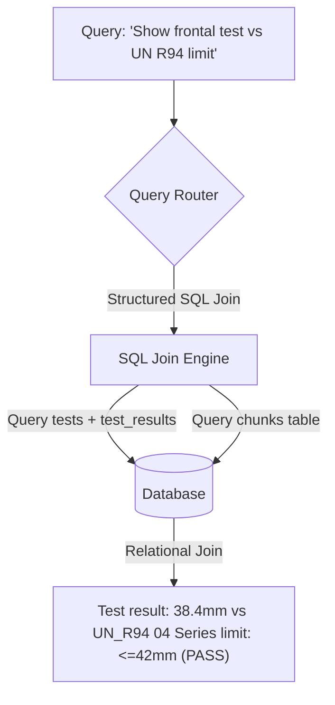

# Harness and Test-Engineering Data Domain Design

This document details the architectural and schema design for integrating a second knowledge domain—harness and test-engineering data (crash tests, sensor channels, CAE correlation)—with the existing AutoSafety regulation RAG platform.

---

## 1. Data Types in Scope

The harness data domain handles physical and virtual verification data:
1. **Sled / Barrier / Crash Test Reports**: PDF/JSON reports containing test configurations, environmental conditions, and executive summaries.
2. **Channel / Instrumentation Data**: Time-series sensor measurements conforming to **SAE J211** (e.g., accelerometers, load cells, potentiometers). Specifies **Channel Frequency Class (CFC)** filtering levels (CFC 60, CFC 180, CFC 600, CFC 1000).
3. **Dummy & Injury Criteria Results**: Summary metrics extracted from dummy sensors (e.g., Head Injury Criterion (HIC36), Thorax Compression Criterion (ThCC), Neck Injury Criterion (NIC)).
4. **CAE-vs-Physical Correlation**: Comparison data linking computer-aided engineering simulation runs with physical test laboratory measurements.
5. **Test Setup & Harness Specs**: Laboratory camera layouts, trigger timings, dummy seating coordinates, and barrier parameters.

---

## 2. Why Test Data Differ from Regulations

Test-engineering data cannot be handled by the same pipeline or logic as public regulations for three fundamental reasons:

1. **Confidentiality & Access Control**:
   - Regulations are public domain. Test results contain highly proprietary, pre-release vehicle design intellectual property.
   - **Data Residency**: Confidential test records must never be exposed to free-tier LLM APIs or models that use prompts/data for training (e.g., free Gemini/ChatGPT).
2. **Numeric & Structured Queries**:
   - Regulatory RAG relies on semantic searches over text paragraphs.
   - Test data queries are predominantly relational, quantitative, and conditional (e.g., "Find all frontal crash tests where dummy thorax compression was greater than 35mm").
3. **Evidentiary Provenance**:
   - Regulations have amendment history.
   - Test reports are legal evidence of compliance. Every record requires a strict chain of custody, linking back to the raw channel data file (`.mme`, `.iso`, or `.csv`), calibration logs, test lab coordinates, and the signing engineer.

---

## 3. Proposed Metadata Schema for Normalized Test Data

To support clean structure-level query capability (e.g., joining tests to their specific channels and results without scans), the schema is split into two tables: `tests` and `test_results`.

### 3.1. Table: `tests` (The Test Event Grain)
Stores metadata for the test event itself.

| Field Name | Type | Description / Example |
| :--- | :--- | :--- |
| `test_id` | `VARCHAR(100)` | Primary Key. e.g., `TEST-2026-94-001` |
| `program` | `VARCHAR(100)` | Vehicle program code. e.g., `SUV-EV-Gen2` |
| `date` | `DATE` | Test execution date. |
| `test_type` | `VARCHAR(50)` | `PHYSICAL_CRASH`, `PHYSICAL_SLED`, `CAE_SIMULATION` |
| `impact_mode` | `VARCHAR(50)` | `FRONTAL_OFFSET`, `SIDE_MDB`, `POLE_SIDE`, `REAR` |
| `dummy` | `VARCHAR(100)` | Dummy type and position. e.g., `Hybrid III 50th Driver` |
| `setup_revision` | `VARCHAR(50)` | Harness configuration version. e.g., `REV_1.4` |
| `signed_off_by` | `VARCHAR(100)` | Engineer name/ID sign-off. e.g., `ENG-7731` |
| `confidential_tier` | `BOOLEAN` | If true, access-restricted. Default: `TRUE`. |
| `created_at` | `DATETIME` | Timestamp of creation. |

### 3.2. Table: `test_results` (The Channel/Injury Grain)
Stores the individual measurements and criteria calculations. One test has many results.

| Field Name | Type | Description / Example |
| :--- | :--- | :--- |
| `result_id` | `INTEGER` | Primary Key. Autoincrement. |
| `test_id` | `VARCHAR(100)` | Foreign Key referencing `tests.test_id` (on delete CASCADE). |
| `channel` | `VARCHAR(100)` | Sensor channel identifier. e.g., `11T000000THACXP` |
| `filter_class` | `VARCHAR(50)` | SAE J211 filter class. e.g., `CFC_180` |
| `peak_value` | `FLOAT` | Maximum sensor value observed during event. |
| `injury_criterion` | `VARCHAR(50)` | e.g., `ThCC`, `HIC36` |
| `value` | `FLOAT` | Calculated injury score. e.g., `38.4` |
| `pass_fail` | `VARCHAR(10)` | Derived computed value: `PASS` or `FAIL`. |
| `linked_regulation_clause`| `VARCHAR(255)`| Format: `REG_CODE#SECTION` e.g. `UN_R94#5` |

---

## 4. Ingestion Invariants and Validation Gates

At ingest time, the ingester enforces three strict checks to ensure data integrity and prevent manual insertion errors:

1. **Link Validation**:
   - The `linked_regulation_clause` (e.g. `UN_R94#5`) must resolve to a valid existing `Chunk` in the database. If no chunk matches `regulation_code` and `section`, the ingestion is refused.
2. **Version Resolution**:
   - The link resolves to the specific regulation version (amendment series) in force at the test event `date`.
   - The ingester queries the active `Regulation` for the given code where `effective_date <= test.date`, ensuring the test evidence points to the exact version of the requirement valid at the time of the test.
3. **Computed Pass/Fail (Never Hand-Entered)**:
   - The ingester inspects the `injury_criterion` of the incoming result and verifies that the linked regulation chunk contains matching criteria rules (e.g., rejecting the record if a user links `ThCC` to a clause that only specifies `HIC36` rules).
   - The system extracts the limit value from the linked chunk (e.g. for `UN_R94` thorax compression: `42.0` mm limit).
   - The ingester calculates `pass_fail` dynamically (e.g. `value <= limit` -> `PASS`, otherwise `FAIL`), enforcing consistency.

---

## 5. Retrieval Design (Hybrid Structured + Linking Layer)

To satisfy query cases like *"show our frontal test results vs the UN R94 ThCC limit"*, the query processor executes a relational join:

1. **Relational Search**: The query router extracts filters (e.g., `impact_mode = 'FRONTAL_OFFSET'` and `injury_criterion = 'ThCC'`).
2. **Linked Join**:
   - Performs a SQL join between `tests`, `test_results`, and `chunks` matching the target regulation version and section.
3. **Combined Response**: Returns the test peak value, derived pass/fail status, and the exact regulatory clause text side by side.

---

## 6. Access-Control & Security Plan

To protect confidential data:
- **Tiered Isolation**:
  - `storage/confidential/` (for physical reports) and the database tables `tests` and `test_results` are isolated.
  - Chunks containing confidential data are stored in the database with a `confidential_tier = True` attribute.
- **Model Gatekeeping**:
  - The application inspects the model configured in the session.
  - If a free-tier/training-enabled model is used, the system **refuses to transmit any context** from the confidential tier.
  - **Local Ollama** (e.g. `llama3`) is the **default allowed/trusted path** since data never leaves the environment.
  - **OpenRouter + ZDR** is marked as **VERIFY-BEFORE-USE**; the gatekeeper treats unverified ZDR as **NOT permitted** by default. Groq paid APIs with signed data processing agreements are permitted.
- **Audit Logging**:
  - Every retrieval or database lookup against the confidential tier writes an audit entry containing:
    `[Timestamp] [User ID/API Key] [Resource: test_id] [Action: SELECT] [Model Used]`

---

## 7. Minimal MVP Slice & Estimation

The MVP slice will demonstrate the end-to-end flow of structured linking:
1. **Ingest a Synthetic Test Event**: Read a JSON file containing one test event and one result, validate chunk existence, derive `pass_fail` against the resolved regulation limit (UN_R94 limit is 42mm), and save.
2. **Authorized Retrieval**: Query using a metadata filter, retrieve the test record joined with its linked regulation chunk, and display them.
3. **Access Refusal**: Swap the API client config to an unauthorized model (Gemini or free model) and verify that the system blocks access and raises a 403 authorization error.

### Effort Estimate
- **Database Schema Updates**: 2.0 hours (creating normalized `tests` and `test_results` tables)
- **Versioned Link Validation**: 3.5 hours (verifying active regulation version at test date, chunk existence)
- **Derived Pass/Fail & Criterion Matching**: 3.0 hours (parsing limits from text, matching criteria)
- **Security & Verification gates**: 1.5 hours (guarding models, auditing)
- **Tests & UI Integration**: 3.0 hours (unit tests + side-by-side display integration)
- **Total MVP Effort**: **13 hours**
